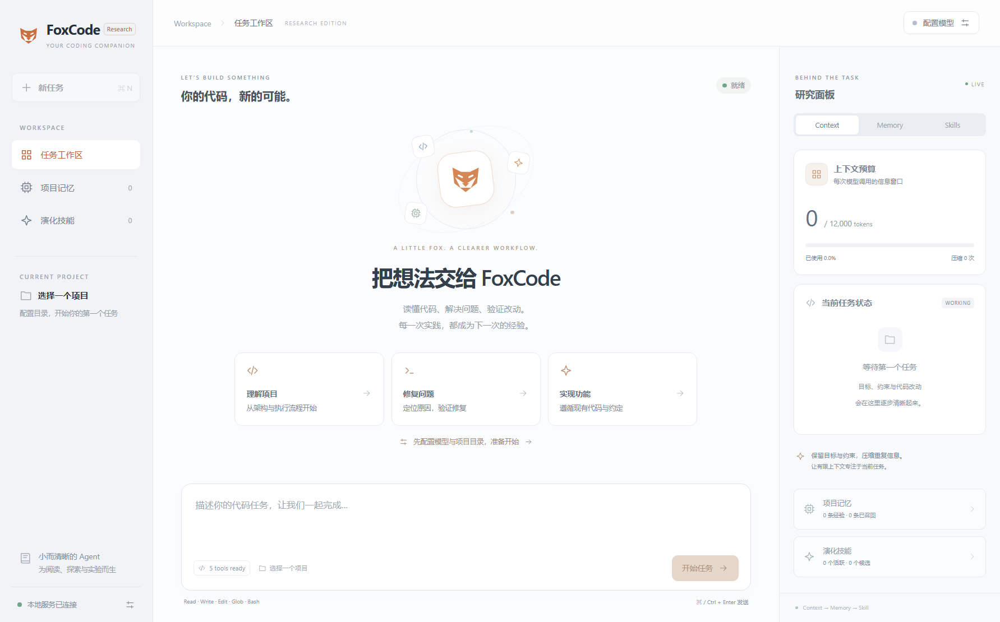

# FoxCode Research

FoxCode is a lightweight research-oriented coding agent that combines a minimal tool-using harness with task-aware context compression, project memory and self-evolving skills.

从 [agent_loop.py](packages/fox_agent_core/src/agent_loop.py) 开始阅读主循环。

```text
React / CLI → HTTP + SSE / Python API → CodingAgent
                                      ├── ContextManager
                                      ├── Project Memory
                                      ├── Skills + SkillEvolution
                                      └── Agent → OpenAI adapter → compatible endpoint
                                             └── Read / Write / Edit / Glob / Bash
```

## 运行

Python 3.12+、uv；前端使用 Node.js 22.12+ 和 npm。在仓库根目录安装 Python 依赖：

```bash
uv sync
```

启动工作台（同一个命令会启动 Python 服务和前端）：

```bash
cd desktop
npm install
npm run dev
```

打开 `http://127.0.0.1:5273`，在右上角「配置模型」或左下角「运行配置」填写模型 ID、API 地址、项目目录和 API Key。
OpenAI、DeepSeek、Qwen、GLM、vLLM 等使用同一个 Chat Completions adapter。
Key 留在服务端内存，接口不回传；留空使用现有或环境密钥。

`npm run dev:web` 只启动前端，适用于已运行服务的情况。也可以单独启动服务并通过环境变量配置：

```bash
export FOX_MODEL=your-model-id
export FOX_BASE_URL=https://your-endpoint/v1
export FOX_API_KEY=your-key
uv run python -m fox_serve --cwd /path/to/project
```
PowerShell 环境变量写法为 `$env:FOX_MODEL="your-model-id"`，其余同理。
界面预览：



静态页面：先在 `desktop` 执行 `npm run build`，再打开 `http://127.0.0.1:8877`。
可选 Electron 窗口：服务运行后，在 `desktop` 执行 `npm start`。

CLI：

```bash
uv run fox --cwd /path/to/project --model your-model-id "Fix the failing parser test"
uv run fox --json "Inspect the test command"
```

## 三个研究模块

- **Context**：本次模型看到的信息。TaskState 记录目标、约束、计划、文件、修改、observations、失败、测试和工作状态。压缩按 utility 选择完整消息组，用户原文受保护。token 估算使用 UTF-8 bytes/3，预算为输出留空间。
- **Memory**：跨任务事实和经验。Working Memory 在 TaskState 中；Episodic/Semantic 存在 SQLite/FTS5，按 BM25、recency、scope、confidence/success 排序。历史项目事实使用前需要工具验证。
- **Skill**：多次证据支持的行为策略。失败→恢复、重复错误、显式用户纠正产生 Candidate。下次任务显式试用，再反馈有效/无效。至少两次独立验证升级 Active；五次成功且置信度足够升级 Mature；低 utility 或长期低收益则 Prune。

Memory/Skill 只检索 top-k 注入 Context，Candidate 不自动注入。JSONL trajectory 可用于后续 SWE-bench/RL 实验；当前没有实现 RL 训练或模型 internalization。

数据在 `<project>/.foxcode/research/`：`memory.sqlite`、`skills.sqlite`、`trajectories.jsonl`。
「新任务」清空 Context/Working Memory，保留长期数据。旧会话、Markdown Memory、旧 Skill 没有兼容包装或自动迁移，原目录数据保留。切模型会重新组装 CodingAgent 并清空当前 Context。

Read/Write/Edit/Glob/Bash 直接在所选目录运行，没有隔离环境。POSIX shell 使用 `/bin/sh`，Windows 使用 `cmd.exe`；需要 PowerShell 时由命令显式调用。

## 验证与文档

```bash
uv run python -m pytest tests -q
cd desktop
npm test
npm run build
```

完整删除清单、合并映射、Before/After/Why、目录树与实测规模见 [重构报告](docs/REFACTOR_REPORT.md)。研究设计及实验边界见 [架构说明](docs/ARCHITECTURE.md)。
