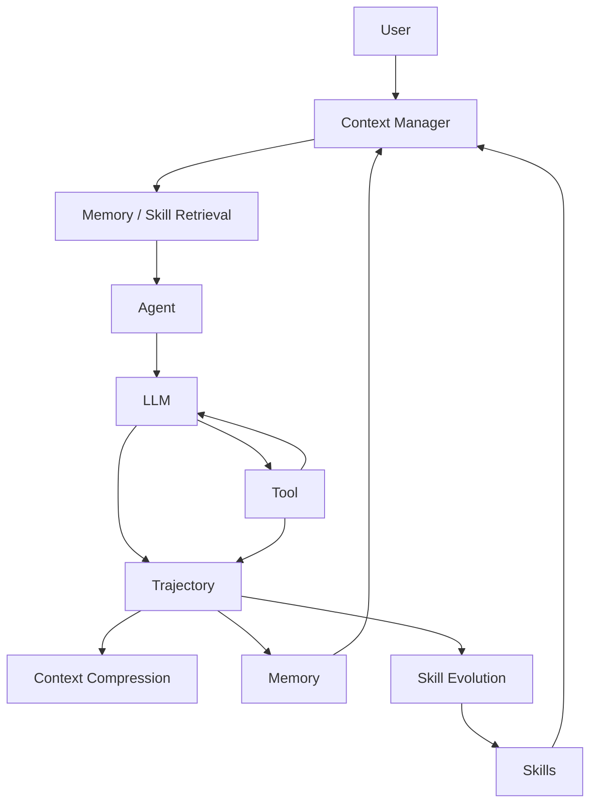

# FoxCode：可阅读、可解释、可实验的 Coding Agent

## 三层边界

| 层 | 输入 → 输出 | 阅读入口 |
| --- | --- | --- |
| fox_ai | Model + Context + StreamOptions → 五种模型事件 | openai_provider.py |
| fox_agent_core | Prompt → 模型/工具循环 → AgentEvent | agent_loop.py |
| fox_coding_agent | 项目任务 + 历史经验 → 受预算约束的 Context + trajectory | coding_agent.py |
| fox_serve / desktop | HTTP/SSE → 任务与研究状态界面 | app.py / App.tsx |

下层不依赖上层。Core 只有五个 callback，没有 Extension 注册器。
FrogNano 的启发是直接组织 messages、tool calls、observations 和 trajectory，而不是复制
它的 Kubernetes/runtime/dataset 系统。这里仍使用 asyncio 流式请求并保留独立研究策略。



实际调用顺序：任务开始检索，组合 system prompt；每次模型调用前检查预算并压缩；
完成模型/工具响应后更新任务状态；run_end 后将轨迹沉淀到 Memory/Skill。

## Task-State-Aware Context Compression

TaskState 显式记录 Goal、Constraints、Active Plan、Important Files、Code Changes、
Tool Observations、Failed Attempts、Test Results、Current Working State。
ContextManager 把结构化 Working Context 和挑选的原始消息传给模型，Recent Raw Context
以完整消息组保留。结构化状态更新来自真实模型/工具 callback，而不是把摘要存成 Memory。

Utility 的五项是 recency、task relevance、dependency importance、failure importance、
explicit user constraint。用户消息优先级最高并始终原文保留；失败 traceback 有额外分数；
旧 Read 输出降权；重复内容移除 recency/relevance/dependency 奖励。
近期组优先选择，再填入高 utility 的旧组；中低 utility 原文由结构化 state 替代或丢弃。

工具 call 和 results 作为完整组选择，避免请求协议损坏。压缩过的 summary 不会在下一次
压缩变成保护用户消息，也不会重复累积。结构化观察字段最多保存 12 项、摘要最多最近 5 项；
真实用户原文不截断。预算容不下 protected input 和 state 时明确报错。

当前用 UTF-8 bytes/3 估算 tokens，包含 system prompt 和工具 schema。它不是厂商 tokenizer，
没有保证精确 token 上限。计划来自模型列表项的 heuristic，未来可对比结构化计划提取或
LLM state 更新，但不能把研究模块重新放进 loop。

可做的实验：固定预算比较 chronological tail、普通摘要、task-aware utility；观察成功率、
工具重读次数、重要约束丢失率、压缩次数及输入 token 消耗。

## Project-Centric Memory

Working Memory 就是当前 TaskState，不写长期数据库。任务结束的具体 trajectory 产生
Episodic；用户明确添加的项目事实写成 Semantic。scope 是规范化项目绝对路径。

MemoryStore 使用 SQLite/FTS5，没有向量数据库。检索时只选择同 project 或 global scope，
先用 BM25 筛选，再叠加小的 recency、scope、confidence、success 奖励。返回 breakdown
便于解释和消融；中文以双字片段建立搜索词，英文按词匹配。

Verify-Before-Use 把历史事实标注为 historical hint，system prompt 要求使用 Read/Glob/Bash
核验文件、版本、命令和代码状态。当前这是可观察的 Agent 指令策略，没有强制事实验证器，
不能把它描述为“过期知识绝不会使用”。命令和路径过期实验可以从 trajectory 检查验证行为。

数据库保存 source、created_at、memory_type、scope、confidence、success、verify。
自动经验 confidence 较低；completed 表示模型结束，不等于任务通过测试。当前不自动从
模型的架构解释推断 Semantic 事实，也不自动升级低置信度经验。

## Experience-Driven Self-Evolving Skill

从失败→恢复、重复错误、显式用户纠正提取候选策略，保存具体失败/替代调用的证据。
这是 candidate heuristic；不同 Bash 命令的恢复也可能并不具备因果关系，需要 held-out 验证。

```text
Trajectory → Experience → Candidate
                          ├── 2 个独立成功证据 → Active
                          │                    └── 5 次成功且 confidence ≥ .7 → Mature
                          ├── 无效证据 → Rejected / Pruned
                          └── 新经验改变指令 → 新 version，重置为 Candidate
```

每个 Skill 保存 name/description/trigger/tags/instructions、source trajectory、success/failure
count、last_used、confidence、version、saved calls、evidence IDs。
Utility = success_count − failure_count + saved_tool_calls。
confidence = (success_count + 1) / (success_count + failure_count + 2)。

Active/Mature 按 name/description/trigger/tags 的 keyword overlap 检索，只注入 top-3。
Candidate 只在显式 trial 时注入。验证必须基于使用过该 Skill 的独立 trajectory；来源不能
验证自身；同一轨迹只能计一次。Useful 必须由实验/用户明确提供，模型自称完成不会升级技能。
更改指令重置证据，防止旧证据证明新策略。至少两个失败且 utility ≤ 0 时 reject/prune；
90 天未使用且 utility < 3 的 Active/Mature 可以 prune。

当前未实现 embedding、LLM 策略归纳、自动交叉验证、RL/internalization。后续可以用这些
模块作为消融实验变量，并以 held-out 任务上的边际收益决定 prune。

## Harness 和数据

Trajectory 是每次 run 的原始模型消息/工具 observation/used skills/结束原因及时间，不受
Context Compression 的原文淘汰影响。保存在项目 JSONL，供后续 rollout/SWE-bench 适配。
工具直接运行在项目环境；外部实验 harness 负责隔离与任务判分。

服务只有单任务 busy guard 与 asyncio cancellation。没有队列调度器、分支、重放或恢复。
停止后补齐中断 tool result，下一轮模型请求不包含悬空 call。前端仅接收 HTTP/SSE 事件。
