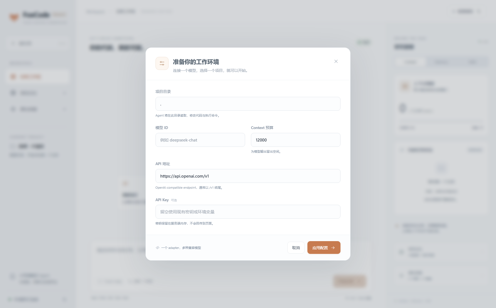

# 工作台界面更新

2026-10-07。FoxCode Research 使用独立 Git 历史发布，原 FoxCode 仓库保持原 remote。

## 交互与布局

- 浅色三栏工作台：项目导航、任务与工具轨迹、研究面板。
- 模型和目录配置放入弹窗，启动时不强制打断阅读；弹窗支持 Escape 和 Tab 焦点循环。
- Context 预算进度和任务状态；Memory 召回与项目知识录入；Skill 候选、试用与反馈。
- 工具调用折叠展示，失败时展开，保留参数、结果与执行状态。
- Ctrl/Cmd+Enter 发送，Ctrl/Cmd+N 新任务；手机布局避免横向滚动，尊重减少动画偏好。
- `npm run dev` 启动 Python 服务和 Vite，复用已运行的本地服务。离线/502/503/504 显示明确连接提示和重新连接按钮。

没有新增 UI 框架、全局状态层或图标库；图标和狐狸标识使用原生 SVG。

## 验证

| 命令/检查 | 结果 |
| --- | --- |
| `uv run python -m pytest tests -q` | 20 passed |
| `cd desktop && npm test` | 7 passed |
| `cd desktop && npm run build` | TypeScript + Vite 通过 |
| `cd desktop && npm run dev` | Python 8877 + Vite 5273 启动，页面代理成功连接 |
| Electron 实际页面验证 | 桌面、弹窗、390px 小屏无横向溢出；SSE 最终回答、4 次工具调用、Memory 与候选 Skill 显示通过 |

Electron 工具轨迹验证使用确定性的模拟模型和真实 Read/Edit/Bash，包含失败后恢复；没有调用收费模型。页面源文件与构建产物均验证过。

公开仓库只包含源码、文档、未执行输出的学习 Notebook 和截图，排除 `.env`、项目记忆库、运行轨迹、虚拟环境、node_modules 与构建缓存。
