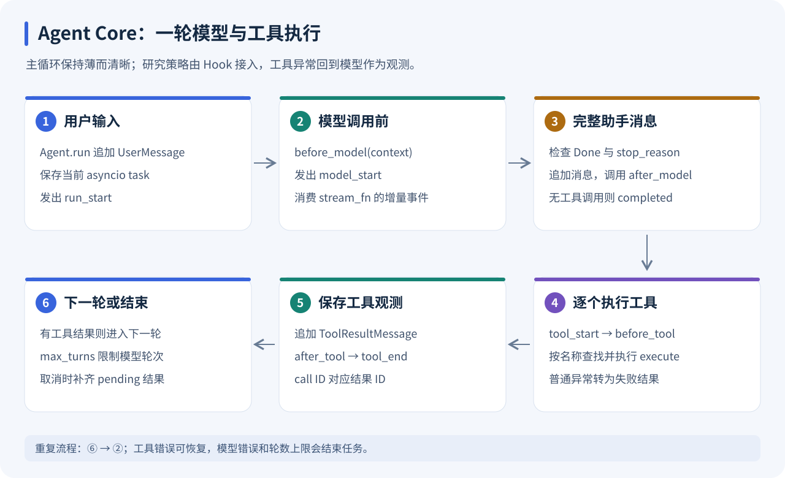
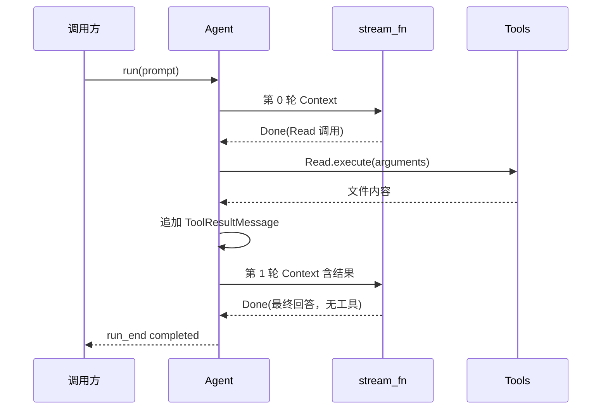
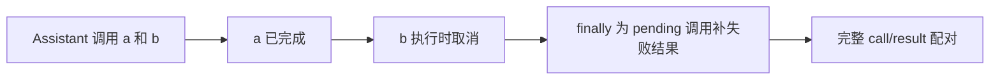

# fox_agent_core：模型与工具之间的执行循环

[返回学习索引](README.md) · 前置：[fox_ai](FOX_AI.md) · 下一篇：[CodingAgent](CODING_AGENT.md)

学习目标：能逐步跟踪 User → Model → Tool → Model；能区分可重试的工具错误、终止运行的模型错误和取消；能说清五个 Hook 插在什么位置。



图中每一圈是一次模型调用。一次模型消息可包含多个工具调用，当前循环按列表顺序执行；调用数量和模型轮数是两个不同指标。

## 1. Agent 与 agent_loop 怎样分工

| 入口 | 负责的状态 / 行为 |
| --- | --- |
| [Agent](../../packages/fox_agent_core/src/agent.py) | 工具索引、Context、当前 asyncio task；追加用户消息；转换运行错误和结束状态 |
| [agent_loop](../../packages/fox_agent_core/src/agent_loop.py) | 调模型、接收最终消息、执行工具、追加结果、继续下一轮 |
| [Hooks](../../packages/fox_agent_core/src/hooks.py) | 五个可选回调，支持同步和异步函数 |
| [AgentTool](../../packages/fox_agent_core/src/types.py) | `schema` 与 `async execute(arguments) -> str` 的工具协议 |

Core 接受 `stream_fn`，因此同一循环既能使用真实端点，也能使用测试里的确定性模型。项目记忆、技能版本和压缩策略由上层 Hook 接入。

`Agent` 构造时按工具名称建立字典，重复名称直接报错。这个校验避免模型调用一个名字时无法判断执行哪一个工具。

## 2. 主循环逐步拆解

下面是便于阅读的伪代码，完整异常处理以源码为准：

```python
append(UserMessage(prompt))
emit("run_start")
for turn in range(max_turns):
    before_model(context)
    emit("model_start")
    message = consume_model_until_done()
    reject_length_or_content_filter(message)
    append(message)
    after_model(message)
    emit("model_end")
    if not message.tool_calls:
        finish("completed")
    for call in message.tool_calls:
        emit("tool_start")
        before_tool(call)
        result = execute_or_error_observation(call)
        append(result)
        after_tool(call, result)
        emit("tool_end")
```

这不是“模型回答一次后再额外执行一些命令”。工具结果回到 Context 后，模型会再次看到它，再决定继续调用工具还是输出最终回答。



`completed` 只表示模型循环正常结束。文件内容是否正确、测试是否充分，需要另看实际工具结果和外部验证。

## 3. 事件与 Hook 的顺序

| 时机 | Hook | 适合接入的上层行为 |
| --- | --- | --- |
| 调模型前，`model_start` 前 | `before_model(context)` | 预算、检索块选择、压缩、登记实际注入 |
| 完整助手消息追加后 | `after_model(message)` | usage 校准、任务状态更新、轨迹 |
| `tool_start` 后，执行前 | `before_tool(call)` | 登记调用及参数 |
| 工具结果追加后 | `after_tool(call, result)` | 文件修订、错误证据、长输出存档 |
| 循环退出 finally | `on_run_end(status)` | 接收循环层结束状态 |

`Hooks.call()` 先调用回调，再用 `inspect.isawaitable` 判断是否需要 await。它不提供插件发现或回调链管理。`CodingAgent` 当前安装前四个 Hook，并在自己的 finally 中保存经验。

Hook 也可能抛异常。不能笼统地说“任何错误都会作为工具观测继续运行”：工具执行区的普通 Exception 会转成结果，但模型阶段与部分 Hook 错误会终止本轮运行。

## 4. 五个工具的输入与边界

源码目录：[tools](../../packages/fox_agent_core/src/tools)。

| 工具 | 必填参数 | 默认 / 限制 | 成功输出 |
| --- | --- | --- | --- |
| Read | `file_path` | offset 从 1 开始；limit 默认 200；约 20,000 字符上限 | 带行号正文，触及限制有提示 |
| Write | `file_path, content` | UTF-8；自动创建父目录；覆盖已有文件 | `Wrote ...` |
| Edit | `file_path, old_text, new_text` | old_text 非空且恰好匹配一次 | `Edited ...` |
| Glob | `pattern` | path 默认 `.`；最多 500 个结果 | 相对搜索根的路径，排序后输出 |
| Bash | `command` | cwd 默认 `.`；timeout 默认 60 秒 | returncode + stdout + stderr |

### Read：分段取证

第一次读 `offset=1, limit=200`，需要后续内容时再用新的 offset。输出带行号帮助定位；limit/字符上限意味着工具观测未必包含整个文件。

### Edit：唯一匹配为什么必要

文件里有两处 `return None` 时，仅把它当 old_text 会报错。正确恢复方法是重新读取、加入附近上下文、保证唯一，再执行局部替换。失败本身成为下一轮模型可见的证据。

### Bash：命令退出怎样变成 observation

成功返回文本；非零退出码抛 RuntimeError，Core 将其转换为 `is_error=True` 的 `ToolResultMessage`。stdout/stderr 分别最多捕获 20,000 字节，但仍持续排空管道，避免噪声输出把子进程阻塞。

POSIX 下用系统 shell，项目说明对应 `/bin/sh`；Windows 使用 `cmd.exe`。名称叫 Bash 不代表会运行交互式 Bash 配置。取消或超时时，POSIX 清理进程组，Windows 调用 taskkill 清理进程树。

这些工具使用项目路径作为默认工作目录，没有实现路径沙箱。绝对路径和父目录路径的含义仍遵循实际文件系统。

## 5. 三类错误要分开理解

| 类型 | 例子 | 后续行为 |
| --- | --- | --- |
| 工具错误 | 文件不存在、Edit 匹配失败、非零命令退出 | 追加失败结果，模型下一轮可修正 |
| 模型 / 循环错误 | 没有 Done、length、端点错误、达到 max_turns | Agent 发 error，再发 run_end error |
| 取消 | `Agent.cancel()` 或外层 task 被取消 | 清理执行资源，结束为 cancelled |

未知工具名称也是工具错误。它不会导致系统去动态安装一个同名工具。

## 6. 取消为什么需要补齐协议

假设模型返回两次工具调用：a 已完成，b 正执行时用户点停止。如果只截断 Python 循环，Context 可能留下 b 的调用却没有 b 的结果。



`pending` 初始包含本轮全部调用，每完成一个结果就移除一个。finally 为剩余调用添加 `Execution interrupted`。这确保后续继续同一 Agent 时，协议结构仍然闭合；它不声称已执行剩下的工具。

`Agent.run()` 捕获取消后发 `run_end(cancelled)`。服务层还持有自己的生产任务，HTTP 断开时会取消并等待它，详见 [Serve](SERVE.md)。

## 7. 可直接运行的离线工具循环

在仓库根目录执行下面脚本。临时目录自动清理，不请求模型端点：

```bash
uv run python - <<'PY'
import asyncio
from pathlib import Path
from tempfile import TemporaryDirectory
from fox_ai.src import AssistantMessage, Done, Model, ToolCall
from fox_agent_core.src import Agent, coding_tools

async def main():
    turns = 0
    async def fake(model, context, options):
        nonlocal turns
        turns += 1
        if turns == 1:
            yield Done(AssistantMessage(tool_calls=[
                ToolCall("w1", "Write", {"file_path": "hello.txt", "content": "hello"})
            ]))
        else:
            assert context.messages[-1].content == "Wrote hello.txt"
            yield Done(AssistantMessage("文件已写入"))
    with TemporaryDirectory() as directory:
        agent = Agent(Model("fake"), coding_tools(Path(directory)), stream_fn=fake)
        async for event in agent.run("写一个文件"):
            print(event.type, event.data.get("status", ""))
        assert Path(directory, "hello.txt").read_text() == "hello"
asyncio.run(main())
PY
```

预期事件顺序：`run_start → model_start → model_end → tool_start → tool_end → model_start → model_end → run_end`。这个 fake 只提供 Done，因此没有 text_delta，仍能完成正常工具循环。

## 8. 阅读、验证与追问

阅读顺序：`Agent.run()` → `agent_loop()` → `Hooks.call()` → Edit/Bash → 取消 finally。每一步都在纸上记录 Context.messages 增加了什么。

```bash
uv run python -m pytest tests/test_agent.py -q
```

重点案例：`test_tool_loop_error_observation_and_hooks` 展示错误观测后的恢复；`test_cancel_closes_pending_tool_calls` 展示中断后的配对；`test_bash_failure_and_timeout_are_observations` 检查 shell 边界。

常见追问：为什么多个工具顺序执行？当前实现以清晰、可审计为先，顺序也避免并发写文件产生隐含依赖冲突；这是实现选择。max_turns 限制什么？限制模型调用轮数，不限制一轮工具数量。怎么新增工具？提供唯一名称的 schema 和 async execute，再加入工具列表；成功返回文本，错误抛异常，由主循环统一处理。
