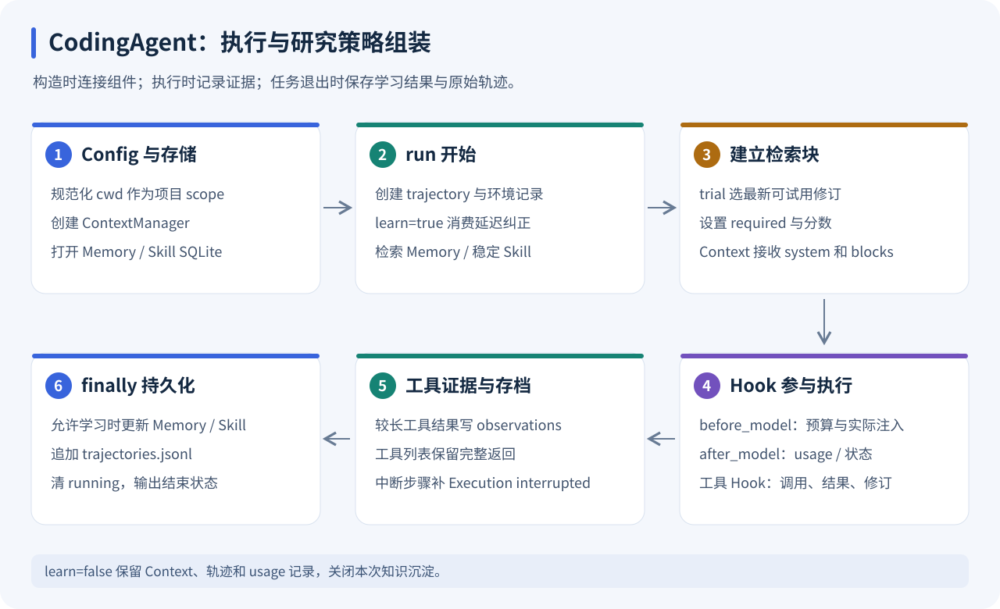
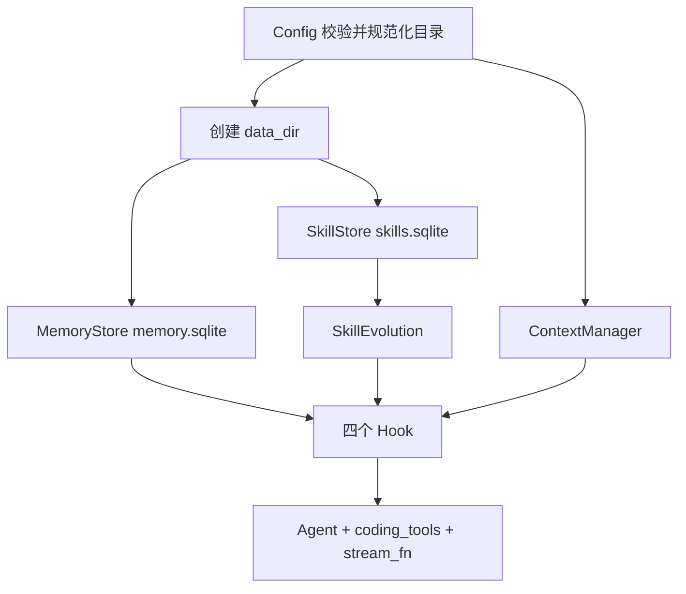
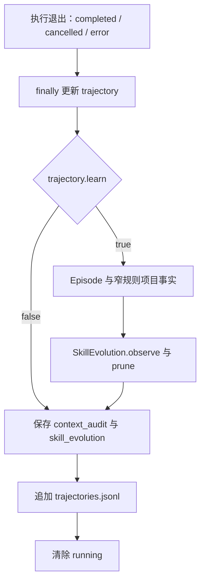

# fox_coding_agent：把研究策略接入可运行的 Agent

[返回学习索引](README.md) · 前置：[Agent Core](AGENT_CORE.md) · 后续：[Context](CONTEXT.md)、[Memory](MEMORY.md)、[Skill Evolution](SKILL_EVOLUTION.md)

学习目标：能够从 `CodingAgent.run()` 找到检索、预算、工具、轨迹和学习的接入点；能解释多次发送、新任务、切项目以及 `learn=False` 的区别。



上排展示任务执行，下排展示研究状态与持久化。Memory/Skill 在任务开始时检索；Context 在每次模型调用前决定本次实际输入。

## 1. 包里有哪些部分

```text
packages/fox_coding_agent/src/
├── config.py          配置、目录、环境变量与 .env
├── coding_agent.py    组装、Hook、轨迹、知识沉淀、snapshot
├── cli.py             命令行入口与输出
├── context/           预算、协议组、压缩、任务状态
├── memory/            SQLite 知识记录与多阶段检索
└── skills/            策略版本、提取、维护、反馈与回滚
```

主入口：[coding_agent.py](../../packages/fox_coding_agent/src/coding_agent.py)。你可以先把后三个目录当成黑盒，理解它们如何进入同一条任务链路，再分别读算法。

| 组件 | 主对象 | 负责什么 |
| --- | --- | --- |
| Context | `ContextManager` | 本次调用预算及工作状态 |
| Memory | `MemoryStore` | 跨任务的具体经历与项目事实 |
| Skills | `SkillStore / SkillEvolution` | 策略版本与经验转候选 |
| Harness | `Agent` | 模型和工具执行 |
| Composition | `CodingAgent` | 连接上述模块，保存审计证据 |

## 2. 构造时发生了什么

`CodingAgent(config)` 创建研究目录，以规范化 `config.cwd` 字符串作为 scope，再打开 Memory/Skill 数据库。它设置四个 Hook，随后构造包含五个工具的 Agent。



实例保留 `memory_hits`、`selected_skills` 和最新 `trajectory`。这些是最近一次运行的状态，不是 HTTP 会话数据库。

## 3. Config：启动配置如何形成

源码：[config.py](../../packages/fox_coding_agent/src/config.py)。

| 参数 | 默认 | 校验 / 意义 |
| --- | --- | --- |
| `cwd` | 启动目录 | expanduser + resolve，必须是目录 |
| `model` | 空 | 必须提供非空 ID |
| `base_url` | `https://api.openai.com/v1` | 模型兼容端点 |
| `context_budget` | 12000 | 至少 512 |
| `context_window` | 32768 | 本地设定的输入输出总窗口 |
| `max_tokens` | 4096 | 正数，输出预留 |
| `max_turns` | 30 | 正数，模型轮数上限 |
| `data_dir` | `<cwd>/.foxcode/research` | 可在 Python 构造时单独指定 |

同时要求 `context_budget + max_tokens <= context_window`。这些是本地配置，服务不会向 provider 自动查询真实模型窗口。

`Config.from_env()` 的查找顺序：从项目目录向父目录找最近 `.env`；找不到再从启动目录向上找；只读找到的第一份。文件值与已有环境变量合并，后者覆盖文件；显式非 None 参数再覆盖环境默认。

支持的环境字段是 `FOX_MODEL / FOX_BASE_URL / FOX_API_KEY / FOX_CONTEXT_BUDGET`；Key 还可回退到 `OPENAI_API_KEY`。HTTP `/api/config` 直接构造 `Config`，不是整体调用 `from_env()`，仅在缺 Key 时按服务逻辑保留或查找密钥。详见 [Serve 配置](SERVE.md)。

## 4. run：任务开始的八个动作

1. 拒绝忙碌重入和空白 prompt。
2. 设置 running，创建 UUID trajectory，登记 prompt、scope、环境和 learn。
3. 允许学习时消费上一任务的延迟纠正窗口；否则清空本次演化决策展示。
4. 对 Memory 和稳定 Skill 做一次检索。
5. 显式 trial 时，把该名称的最新可试用修订放在优先位置，总 Skill 数仍最多 3。
6. 记录召回 ID/版本，建立检索块；trial 块标记 required。
7. 设置 Context 的 system prompt 与检索源，更新当前用户目标。
8. 进入 Agent.run，转发事件并在特定时机发 research_state。

Memory/Skill 不是每个模型 token 到达时重新搜索。检索块可能在后续模型调用中因为预算变化而未注入，必须看每次 `context_calls`。

## 5. 四个 Hook 接入点

| Hook | CodingAgent 方法 | 产生的证据 |
| --- | --- | --- |
| before_model | `_before_model()` | `context_calls`、实际注入 name/version、注入计数 |
| after_model | `_after_model()` | usage 校准、TaskState、完整模型消息 |
| before_tool | `_before_tool()` | call 参数，先设 result 为 None |
| after_tool | `_after_tool()` | result、文件修订、失败证据、长观测存档 |

工具返回正文长度大于 2400 字符时，存入 observations 文本文件。文件名由 trajectory ID 与 call ID 的 SHA-256 前 24 位构成；该路径再登记到 TaskState 和轨迹。它是完整工具观测的副本，供压缩后重新读取。

如果中断留下 result=None，CodingAgent 的 finally 会为轨迹补 `Execution interrupted`。Core 也有协议补齐，但两者保存目标不同：一个修复模型消息配对，一个保证研究工具步骤可审计。

## 6. 结束时怎么沉淀



有工具步骤时，自动 Episode 从本次 trajectory 提取任务、失败、成功 Write/Edit、检查输出和文件指纹。自动项目事实只对已识别的成功检查命令采用窄规则；SkillEvolution 根据失败恢复或明确纠正产生候选。

`_save_experience()` 的 finally 保留轨迹，即使研究更新抛异常，也会尝试写入原始执行证据。磁盘不可写等存储故障仍可能让最终保存失败，不能把 finally 理解成无条件写入保证。

## 7. 生命周期：哪些东西会保留

| 操作 | Context / Working | 长期数据库 | 原始轨迹 |
| --- | --- | --- | --- |
| 同一实例继续发送 | 延续已有消息与状态 | 同一项目库 | 每次 run 新增一条 |
| HTTP 新任务 reset | 重建 CodingAgent，清空内存状态 | 同一 Config 的库保留 | 文件保留，内存最新 ID 清空 |
| HTTP 应用配置 | 成功构造后替换实例 | 新 cwd 默认对应新项目库 | 旧项目文件留在原目录 |
| `learn=False` | 仍正常预算与执行 | 读取；仍有 Skill 操作性 usage 更新 | 仍追加 |
| 关闭服务 | 内存消失 | 关闭连接，文件保留 | 已保存记录保留 |

`learn=False` 关闭新的 Memory/Skill 学习和延迟纠正消费，不能理解成数据库绝对只读。普通任务默认 True；显式 trial 默认 False；调用方可明确覆盖。

## 8. 数据目录与轨迹字段

```text
<project>/.foxcode/research/
├── memory.sqlite       记忆、证据与 FTS 索引
├── skills.sqlite       修订、稳定指针、反馈及 pending
├── trajectories.jsonl  每次运行一行 JSON
└── observations/       较长工具返回正文
```

| 字段 | 如何使用 |
| --- | --- |
| `id / scope / environment` | 关联任务、项目和实际执行 shell |
| `status / learn` | 判断执行结束与学习模式 |
| `tools / messages` | 回查参数和原始返回 |
| `retrieved_memories / retrieved_skills` | 看任务开始时召回了谁 |
| `used_skill_versions` | 看实际注入的具体版本 |
| `context_calls / context_audit` | 查预算与每轮注入决定 |
| `skill_evolution` | 查候选的提取 / 维护理由 |

建议只读取需要的字段，避免把整个原始轨迹直接展示到公共文档。仓库提供研究记录机制，但未自动形成 benchmark 判分器。

## 9. 离线跑通整个组合层

在仓库根目录运行。临时项目内会出现数据库和轨迹，退出后自动清理：

```bash
uv run python - <<'PY'
import asyncio, json
from pathlib import Path
from tempfile import TemporaryDirectory
from fox_ai.src import AssistantMessage, Done, ToolCall
from fox_coding_agent.src import CodingAgent, Config

async def main():
    turns = 0
    async def fake(model, context, options):
        nonlocal turns
        turns += 1
        if turns == 1:
            yield Done(AssistantMessage(tool_calls=[
                ToolCall("w1", "Write", {"file_path": "answer.py", "content": "print(42)\n"})
            ]))
        else:
            yield Done(AssistantMessage("已写入 answer.py"))
    with TemporaryDirectory() as directory:
        agent = CodingAgent(Config(cwd=Path(directory), model="fake"), stream_fn=fake)
        try:
            async for event in agent.run("创建 answer.py", learn=False):
                if event.type == "run_end":
                    print(event.data)
            path = Path(directory, ".foxcode/research/trajectories.jsonl")
            record = json.loads(path.read_text())
            assert record["status"] == "completed" and record["learn"] is False
            assert agent.memory.counts() == {}
            print("工具步骤:", len(record["tools"]), "模型调用:", len(record["context_calls"]))
        finally:
            agent.close()
asyncio.run(main())
PY
```

预期一条 Write 工具步骤、两次模型调用。再将 learn 改为 True，观察 Episode；不能仅凭这次 completed 就产生“代码正确率提高”的结论。

## 10. 源码路线与验证

先读 `__init__ → run → 四个 Hook → _save_experience → snapshot → validate_skill`；再进入三个研究模块。CLI 只是把同一个 run 的事件打印成人可读内容或 JSON，不另造执行引擎。

```bash
uv run python -m pytest tests/test_config.py tests/test_research.py tests/test_research_policies.py -q
```

追问：为什么用 Hook？研究策略能替换，主循环仍可独立测试。状态面板是否等于执行全记录？snapshot 是摘要，完整轨迹在 JSONL。为什么先构造配置替代实例再关闭旧实例？服务要在新配置失败时保留旧 Agent，细节见 Serve。
