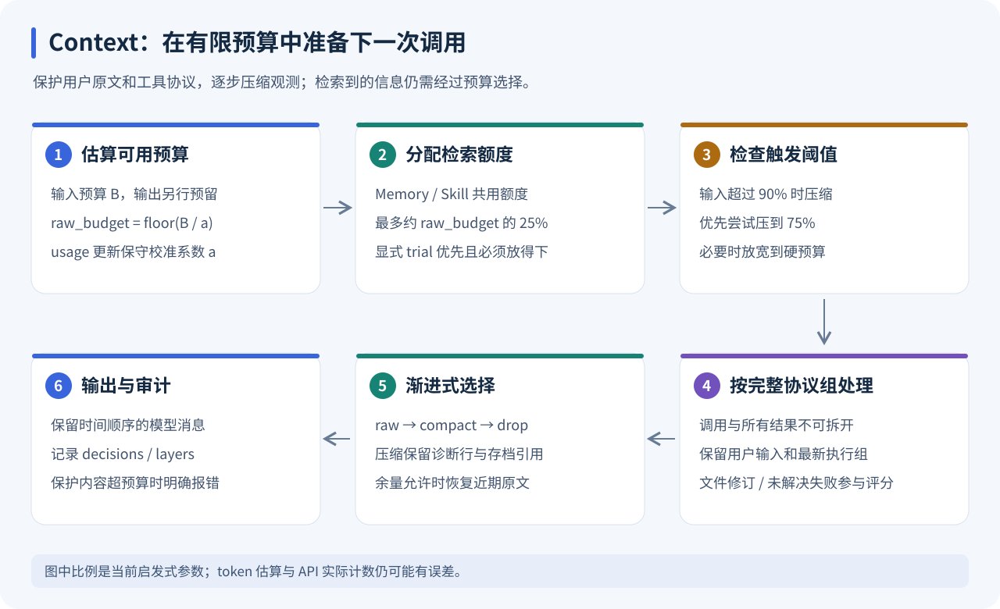
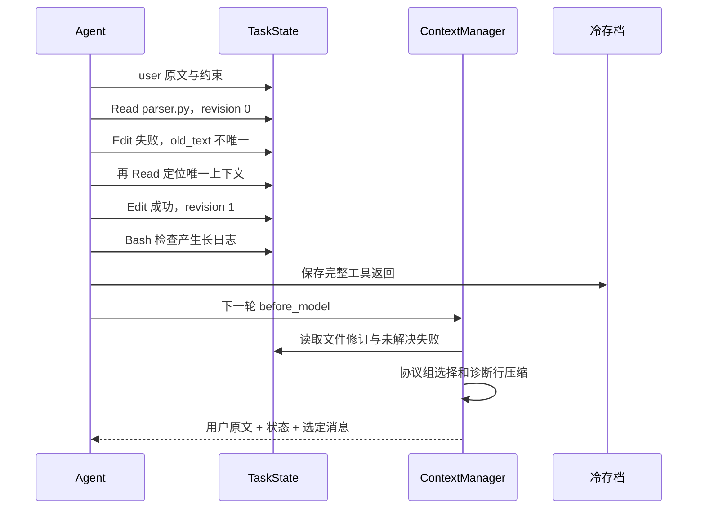

# Context：任务状态驱动的信息预算管理

[返回学习索引](README.md) · 前置：[CodingAgent](CODING_AGENT.md) · 关联：[Memory](MEMORY.md)、[Serve](SERVE.md)

学习目标：能计算可用预算、识别完整工具协议组，解释 raw/compact/drop 的选择，并通过面板和轨迹定位一次压缩决定。



图中 ①—⑥ 对应一次 `prepare()`。每次模型调用都会准备输入，但只有超过触发阈值时才执行压缩；图示不表示每轮都会丢消息。

## 1. 从一个实际问题出发

Agent 读取一个几千行的文件，再跑一段很长的测试日志。几轮之后，原始消息已经超出预算。只保留最近 N 条消息可能把用户约束删掉；只做摘要可能丢掉异常位置；按消息分别删除还可能留下一个没有对应调用的工具结果。

所以这里同时解决三个问题：下一次调用预算、任务连续性、工具协议完整性。压缩单位不是普通聊天句子，而是带证据的执行片段。

相关背景：[Lost in the Middle](https://arxiv.org/abs/2307.03172) 在问答和键值检索任务中研究了相关信息位置对长上下文使用的影响。这支持“窗口变长不等于相关信息总能被有效使用”的问题意识；它不是本项目压缩算法的效果证明。

## 2. 四个信息层

| 层 | 例子 | 策略 |
| --- | --- | --- |
| 固定协议 | system prompt、工具 schema | 计入预算，保持工具接口完整 |
| 用户输入 | 目标、追加约束、纠正 | 所有真实 user 消息原文保留 |
| 工作状态与近期证据 | 活跃文件、修改、失败、最新执行组 | 结构化摘要 + 近期原始或压缩片段 |
| 外部检索 | Memory 和 Skill | 在独立上限内选择，可因预算不足不注入 |

检索得到的信息不一定进入 prompt。`retrieval_selected` 和 `retrieval_dropped` 记录最终选择。显式试用的 Skill 如果放不下，会报错，避免用户以为试用了实际未注入的策略。

## 3. 预算公式与估算校准

源码：[manager.py](../../packages/fox_coding_agent/src/context/manager.py)、[compressor.py](../../packages/fox_coding_agent/src/context/compressor.py)。

设：

```text
B = min(context_budget, context_window - max_tokens)
a = API usage 校准系数，初始为 1
B_raw = floor(B / a)
```

`max_tokens` 为生成端预留输出空间。`Config` 还会检查输入预算与输出预算之和没有超出配置窗口。

基础估算是序列化内容的 UTF-8 字节数除以 3，包含 messages、system prompt 和工具 schema。它容易理解、支持中英文，但不是厂商 tokenizer，也不是严格的上界。

模型提供实际 `usage.input_tokens` 后：

```text
r = clip(actual_input_tokens / last_raw_estimate, 0.5, 3.0)
a_next = max(1, 0.8 * a + 0.2 * r)
```

只往保守方向使用校准：即使实际 token 比估算少，也不会把预算放宽到基础估算之下。系数在同一会话的不同请求间持续更新。未知的 provider 计数规则、缓存计数和不提供 usage 的端点仍是限制。

检索层的可用量为：

```text
R = max(0, min(0.25 * B_raw,
              B_raw - cost(protected_users + base_system + schemas) - 400))
```

400 是给工作状态和近期上下文留的启发式余量。Memory 与 Skill 共享检索额度，块按显式试用优先、分数其次排序。这是预算分配策略，不是严格解最优背包问题。

## 4. 为什么需要迟滞

每次超过 `0.9 * B_raw` 就触发压缩，目标压到 `0.75 * B_raw`。如果保护内容和最新执行组无法压到这个目标，允许在硬预算内再尝试。

```text
低于 90%：继续执行
超过 90%：尝试压到 75%
75% 放不下：尝试硬预算
硬预算仍放不下：明确报错
```

上下阈值之间的空隙减少“每个工具返回后都重新压缩”的频繁抖动。这里没有为了省 token 偷偷截断真实用户输入；过长约束和巨大工具参数确实可能要求增大预算。

## 5. TaskState：从聊天记录变成执行状态

源码：[state.py](../../packages/fox_coding_agent/src/context/state.py)。

`TaskState` 保留目标、约束、计划、重要文件、修改、测试、当前工作内容，同时增加：

| 字段 | 意义 |
| --- | --- |
| `file_state` | 每个文件的进程内修订号、最近读取和修改的 call ID |
| `read_versions` | 每一次 Read 对应的文件修订，而非只记最后一次 Read |
| `failure_cases` | 失败 call ID、资源、错误、状态和后续重试证据 |
| `test_runs` | 检查命令、工具结果状态、来源 call ID |
| `artifacts` | 长观测的冷存档位置 |
| `sequence` | 工具观测的逻辑顺序 |

示例：

```text
Read(parser.py) -> revision 0
Edit(parser.py) -> revision 1
历史 Read 仍对应 revision 0 -> 过时惩罚 + 摘要提醒重新读取
再次 Read(parser.py) -> 获得 revision 1 的当前观测
```

这里的修订号只跟踪本 Agent 的 Write/Edit。外部编辑、Bash 写文件不在这个计数器里；跨任务的文件变化由 Memory 文件指纹辅助检测。

失败之后同工具、同资源执行成功，标记 `retry_succeeded`。这说明存在一个成功重试，不等于证明原始错误已被根治。测试状态里的 `command_succeeded` 同样仅表示工具执行成功。

模型文本中的列表项目前用作计划候选，属于启发式提取，不是严格结构化 planner。摘要也不取代原始用户约束。

## 6. 工具协议组为什么不能拆

源码：`compressor.groups()`。

```text
Assistant(tool_calls=[Read a, Read b])
  + ToolResult(a)
  + ToolResult(b)
= 一个不可拆的协议组
```

删除一个组可以，保留调用却删除其中一个结果不可以。函数检查重复 call ID、缺失结果和孤立 tool result。一个组内可以包含多个并列工具调用。

组选择后按原始时间顺序恢复，而不是按分数重排。这维持观测与操作的先后关系。

## 7. 渐进压缩：原文、压缩观测、淘汰

`compact_observation()` 是确定性的抽取式压缩：

1. 保留输出开头。
2. 保留包含 Error / FAILED / Traceback / passed / returncode / assert 的诊断行。
3. 保留输出结尾。
4. 加入原始 evidence 的存档引用。

较长输出由 `CodingAgent._after_tool()` 写入 `.foxcode/research/observations/*.txt`，原始 trajectory 也仍保存完整结果。模型可用现有 Read 工具读取存档，不需要新增复杂的缓存服务。

```text
原始长日志
  -> 小片段 + source reference
  -> 如需更多证据，用 Read 获取存档
```

执行时暂时仍在 Python 中保留轨迹原文，冷存档主要解决模型输入预算，不能宣称进程内存也按同样比例下降。Read 工具本身已有输出限制，因此“原始观测”指工具返回给 Agent 的完整结果，不一定是文件或进程输出的全部字节。

Assistant 的 reasoning 在压缩版本中可以移除；工具调用参数不截断，避免把参数损坏成一个不同操作。小结果可直接保留。选择完成后，如果还有空余预算，从最新组开始恢复原文。

## 8. 解释得清楚的 utility

源码：[scorer.py](../../packages/fox_coding_agent/src/context/scorer.py)。

```text
U = recency + task_relevance + dependency_importance
  + failure_importance + explicit_user_constraint
  + novelty + unresolved + stale_penalty
```

较旧的 Read 降低 recency；过时的文件读取扣分；未解决失败加分；重复内容减少 novelty。工具参数参与任务关联度判断，避免只有空 assistant content 导致路径依赖丢失。

先保护用户输入，再保护最新非 user 执行组，尝试近期组，然后按 `U / cost(compact_group)` 选择较旧组。对旧组还要求 `U >= 3`。这是可解释的贪心启发式；没有全局最优性保证，也没有训练这些权重。

报告包含 `group/action/utility/tokens/reason`。前端能看到一组被 raw 保留、compact 保留还是 drop，trajectory 中也保存最后一次压缩报告和近期预算历史。

## 9. 按调用顺序读源码

```text
CodingAgent._before_model
  -> ContextManager.prepare
     -> 分配检索层
     -> estimate_tokens
     -> compress
        -> groups
        -> score + compact_observation
        -> 保护 + 按单位 token 效用选择
        -> 恢复原文并生成 decisions
  -> 记录本次实际注入的 Skill 版本
```

阅读时先看 manager，再看 compressor，最后看 scorer 和 state。不要一开始就记全部分值。

## 10. 可以动手的学习练习

```bash
uv run python -m pytest tests/test_research_policies.py -q -k 'compression or protocol or layer or state'
```

建议修改测试里的预算、日志长度与错误位置，观察机制是否仍满足：用户原文保留、工具配对有效、最新观测可追溯、预算不足可解释。真实收益要另做固定任务集实验。

## 11. 面试追问与回答方向

**为什么不是 summarize everything？** 摘要可能遗漏约束和具体异常。这里把不可丢的原文、结构化状态、可重取的观测分开，降低单份自由摘要承担的责任。

**压缩后信息怎么恢复？** 通过 evidence 引用读取长观测存档；当前没有自动补读调度器，需要模型按来源使用 Read。

**怎么保证 token 不超限？** 不能保证 provider 的精确计数。目前是保守估算加 usage 校准和输出预留；严格场景需要对应 tokenizer 或服务端预估接口。

**dependency-aware 到什么程度？** 已实现工具调用/结果闭合、文件修订关联、失败/重试关联。没有实现跨工具任意因果图，也不会从日志相邻关系推出因果关系。

**如何验证有用？** 相同模型、任务和预算比较 tail-only、普通摘要、当前策略；观察任务判分、输入 token、重读次数、约束遗漏。使用独立外部任务判分器，不能拿“模型说完成了”算通过。

## 12. 后续研究设计，当前未实施

可拆开的消融变量：渐进观测压缩、utility、状态摘要、检索额度、校准和迟滞。可扩展为结构化计划更新、基于任务阶段的预算份额、真实 tokenizer、学习到的 utility。先固定基线和任务集合，再讨论复杂化。

## 13. 手算一次预算变化

下面数值只是教学推演，不是实验测量。设预算 12000，窗口 32768，输出预留 4096，当前校准系数 a=1：

| 量 | 算式 | 值 |
| --- | --- | --- |
| 有效输入预算 B | min(12000, 32768−4096) | 12000 |
| 原始估算预算 | floor(B/a) | 12000 |
| 压缩触发阈值 | floor(0.9×12000) | 10800 |
| 目标 | floor(0.75×12000) | 9000 |
| 检索额度比例上限 | floor(0.25×12000) | 3000 |

如果当前 before=11000，就会尝试压到 9000。若用户原文、最新组和固定内容只能压到 9600，则重新尝试硬预算 12000；只要最终满足硬预算，仍可以继续。

假设本轮 last_raw_estimate=10000，API 报 input_tokens=14000：

```text
r = 14000 / 10000 = 1.4
a_next = max(1, 0.8×1 + 0.2×1.4) = 1.08
下一轮 raw_budget = floor(12000 / 1.08) = 11111
```

预算数值没改，但下一轮可接受的基础估算变小。这是对估算偏低的修正，而不是把 provider 的真实模型窗口自动检测出来。

检索最多 3000 也只是比例上限：如果保护内容已经占据大部分空间，实际 room 会更小，甚至为零。显式 trial 放不下时直接报错，普通 Memory/Skill 可以被记录为 dropped。

## 14. 跟着一条失败恢复轨迹走

教学场景：用户要求只修改 parser 的边界逻辑，不能改变公开 API。



应当看到的机制是：用户约束仍在；旧 Read 与修订关联；日志存在 evidence 路径；tool_calls 与 tool results 仍配对。不要先期待某个固定压缩倍数，实际选择取决于预算、内容和评分。

| 问题 | 先看字段 | 去哪里继续找 |
| --- | --- | --- |
| 某段日志怎么不见了 | decisions 的 raw/compact/drop | observations 与原始 trajectory |
| 明明召回了却没进入模型 | retrieval_selected/dropped | context_calls 的每轮记录 |
| 旧文件信息仍被引用 | file_state/read_versions | 当前文件再次 Read |
| 失败有没有被处理 | failure_cases | retry_succeeded 的后续 call ID |
| 面板数字不等于真实 usage | calibration、actual_input_tokens | provider usage 与估算输入 |

## 15. 不依赖模型的校准练习

在仓库根目录执行：

```bash
uv run python - <<'PY'
from fox_ai.src import Context, UserMessage, Usage
from fox_coding_agent.src.context import ContextManager

manager = ContextManager(12000, context_window=32768, max_tokens=4096)
manager.set_sources("Inspect current files before editing.", [])
context = Context(messages=[UserMessage("只修改 parser 的边界逻辑")])
manager.prepare(context)
before = manager.calibration
manager.observe_usage(Usage(input_tokens=manager.last_estimate * 2))
manager.prepare(context)
assert manager.calibration > before
assert context.messages[0].content == "只修改 parser 的边界逻辑"
print(manager.snapshot()["calibration"], manager.snapshot()["layers"])
PY
```

这只验证 usage 校准与用户输入保护，不模拟完整长日志收益。压缩边界、孤立结果和重复 call ID 用现有机制测试检查更合适。

最后自查：能否说明触发阈值和硬预算不同？能否解释检索额度不足时 trial 与普通块的差异？能否从一条 compact 决策回到完整观测？能否说清文件修订并不覆盖任意外部写入？
