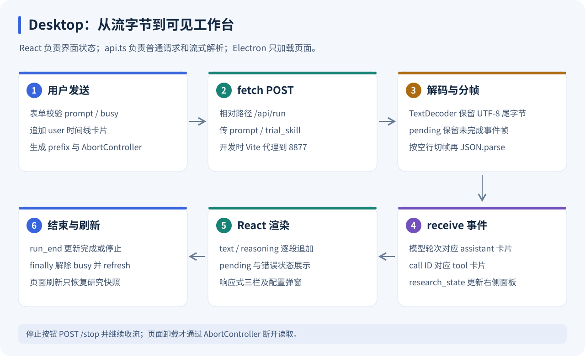
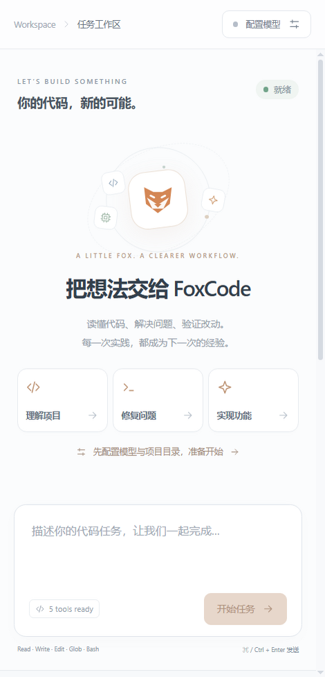
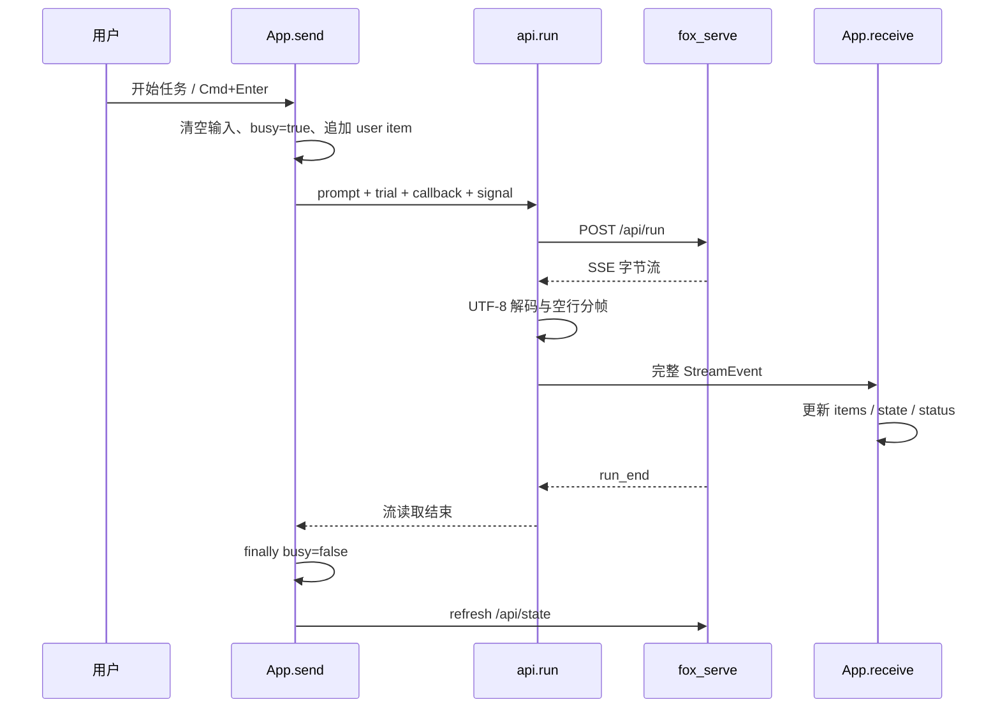

# desktop：React 工作台、流式解析与 Electron 窗口

[返回学习索引](README.md) · 前置：[Serve](SERVE.md)

学习目标：能启动并操作工作台；能追踪一次 Prompt 从表单到 fetch，再从 SSE 到 React 时间线；能解释浏览器、构建页面和 Electron 使用同一套 UI 的原因。



图中把“HTTP 流字节”“完整事件”“页面状态”分成三个步骤。每个网络分片既不等于一个字符，也不等于一个完整 JSON 事件。

## 1. 先用截图认清界面

以下是仓库已有的界面预览，用于定位控件，不代表本次连接真实模型的运行结果。


图 1：左侧是项目与研究模块导航，中间是任务时间线和 Prompt，右侧是 Context / Memory / Skills。左侧切换研究模块时，会更新右侧标签页；它不是文件浏览器或另一套会话。


图 2：配置弹窗填写项目目录、模型 ID、输入预算、API 地址和 Key。项目目录是 **Python 服务所在机器** 的路径，建议绝对路径；并非浏览器上传一个文件夹。



图 3：小屏会收起导航并把研究面板放到工作区下方。图示反映 CSS 布局，当前没有单独移动端应用。

## 2. 目录地图与推荐阅读顺序

| 文件 | 责任 | 读的时候关注什么 |
| --- | --- | --- |
| [src/main.tsx](../../desktop/src/main.tsx) | 挂载 React | 页面根入口 |
| [src/types.ts](../../desktop/src/types.ts) | 页面类型 | ResearchState、StreamEvent、TimelineItem |
| [src/api.ts](../../desktop/src/api.ts) | 普通请求与流式解析 | request、consumeEvents、run |
| [src/App.tsx](../../desktop/src/App.tsx) | 状态、操作与渲染 | refresh、send、receive、stop、reset |
| [src/styles.css](../../desktop/src/styles.css) | 三栏、弹窗、响应式 | main-grid、媒体查询 |
| [src/icons.tsx](../../desktop/src/icons.tsx) | SVG 图标 | 公共视觉元素 |
| [scripts/dev.mjs](../../desktop/scripts/dev.mjs) | 协调 Python 和 Vite | 探活、启动、退出 |
| [vite.config.mts](../../desktop/vite.config.mts) | 开发地址与代理 | 5273、strictPort=false、/api |
| [electron/main.js](../../desktop/electron/main.js) | 可选原生窗口 | loadURL、webPreferences |

推荐先 types → api → App.send → receive → JSX。把流程弄清后再看 CSS；不必先背所有样式类。

## 3. 运行形态与启动步骤

前提：根目录执行 `uv sync`；前端按仓库约定使用 Node.js 22.12+ 和 npm。

### 开发工作台

```bash
# 仓库根目录
uv sync
cd desktop
npm install
npm run dev
```

打开终端的 Local 地址。Vite 默认 5273，允许自动选后续端口；Python 默认 8877。每个 fetch 都请求相对路径 `/api/...`，由开发代理转发，不直接硬编码浏览器端的模型 Key。

`dev.mjs` 对 8877 的 state 进行 1 秒超时探活，成功且 configured 是 boolean 就复用。否则 spawn `uv run python -m fox_serve`，最多轮询 120 次，每次之间等待 500ms；单次探活也可能耗时，因此这不是严格 60 秒总时限。

| 命令 | 实际作用 |
| --- | --- |
| `npm run dev` | 协调后端 + Vite |
| `npm run dev:web` | 仅 Vite，后端需自行启动 |
| `npm run typecheck` | TypeScript 检查 |
| `npm test` | Vitest 测试 |
| `npm run build` | TypeScript 检查 + 构建到 dist |
| `npm start` | Electron 加载已有 HTTP 页面 |

退出 dev 脚本时只清理由脚本启动的 backend；已复用的服务不会被当作它创建的子进程结束。uv 路径有问题时可设置 `FOXCODE_UV_CMD`。

### 构建与 Electron

```bash
# desktop 目录
npm run build
# 另一个终端，在仓库根目录
uv run python -m fox_serve
# desktop 目录
npm start
```

构建后需要服务在创建时检测到 dist，已有服务可重启。Electron 默认加载 `http://127.0.0.1:8877`；`FOXCODE_UI_URL` 可指定已启动的 Vite 地址，例如 5273。Electron 没有自行启动 Python，也没有 preload/IPC 数据层。

## 4. 三种状态对象不要混用

| 类型 | 谁产生 | 内容 | 生命周期 |
| --- | --- | --- | --- |
| `ResearchState` | `/api/state` 或 research_state | 模型、目录、预算、Memory、Skills、trajectory_id | 最近服务快照 |
| `StreamEvent` | SSE | type 和 data | 一次增量事件 |
| `TimelineItem` | App.receive | user / assistant / tool 卡片 | 当前页面内存 |

浏览器刷新后会重新取得研究快照，但不会从 JSONL 自动还原任务时间线。轨迹在后端持久化，与前端 items 是否显示是两回事。

`ResearchState` 的许多字段是 optional，因为未配置服务只返回 configured。TypeScript 类型是编译时约束，当前 API 层没有加入运行时 schema 校验。

## 5. App 内的状态如何分组

| 状态 | 作用 |
| --- | --- |
| `state` | 最近后端 ResearchState |
| `items / prompt` | 时间线与用户输入 |
| `busy / status / error` | 请求中、任务状态与错误提示 |
| `connected` | null 连接中，false 失败，true 已取得服务状态 |
| `panel / configOpen / memoryOpen` | 研究页签和弹窗 |
| `trial` | 下次发送时附带的 Skill 名称 |
| `model / cwd / baseUrl / apiKey / budget / saving` | 配置表单 |
| `controller` ref | 本次 fetch 的 AbortController |
| `bottom` ref | 更新 items 后滚动到时间线末端 |

`busy` 是当前页面的流读取状态；`state.running` 是后端状态。多个浏览器共享服务时，页面未必事先知道另一页面正在运行，服务的 409 才是权威保护。

## 6. 一次发送：从表单到时间线



send 拒绝空白输入和本页忙碌重入，生成 UUID prefix。助手 ID 由 prefix 加模型轮次构成；工具 ID 使用 prefix 加 call.id。这样同一工具 call ID 在不同发送中不会撞到旧卡片。

使用 `setItems(old => ...)` 基于最新状态追加分片，避免回调捕获旧 items 导致丢字。model_start 先创建助手卡片，后续 text/thinking 才知道追加到哪一个 id。

## 7. 事件怎样改变界面

| 事件 | App.receive 的动作 |
| --- | --- |
| model_start | 新建 pending assistant 卡片 |
| text_delta | 追加到该助手 text |
| thinking_delta | 追加到 reasoning，显示为可展开区域 |
| model_end | 助手 pending=false |
| tool_start | 创建带完整 call 参数的工具卡片 |
| tool_end | 以 call.id 找到卡片，写入 content/is_error，结束 pending |
| research_state | 替换 ResearchState，更新研究面板 |
| error | 更新错误提示 |
| run_end | 更新完成/停止/失败，清理遗留 pending |

目前没有独立处理 run_start 和 tool_call_delta 的渲染分支。工具卡片在 tool_start 拿到完整参数时创建；不能根据传输层有 tool_call_delta 就宣称页面逐字符显示工具参数。

正文目前是 React 普通文本节点，CSS `white-space: pre-wrap` 保留换行；没有 Markdown 渲染器。模型输出 `**标题**` 会显示对应文本字符。工具参数用 JSON.stringify 格式化到 pre 中。

## 8. SSE 分帧器逐行理解

核心：[api.ts 的 consumeEvents](../../desktop/src/api.ts)。

```text
ReadableStream Uint8Array
  → TextDecoder.decode(value, {stream:true})
  → pending 字符串缓冲
  → 将 CRLF 归一为 LF
  → 找到 \n\n，切出完整 frame
  → 提取 data: 行并拼接
  → JSON.parse
  → onEvent(event)
```

为什么需要两层缓冲？UTF-8 的“你”占多个字节，字节分片可能切在字符中间；即使解码成功，JSON 仍可能被网络切成多个片段。TextDecoder 保留未完成字符，pending 保留未完成帧。

教学例子：

```text
网络块 A：data: {"type":"text_delta","data":{"delta":"你
网络块 B：好"}}\n
网络块 C：\ndata: {"type":"run_end", ...}\n\n
```

A/B 都不能立即 JSON.parse。C 到达后出现双换行，才可交付第一帧。这里用可见的 `\n` 表示换行；真实传输中是换行字节。

读到网络 EOF 后还会执行 decoder.decode() 刷新，再消费完整帧。如果始终没见 run_end，则报“连接提前结束，任务状态未知”。不完整尾帧不会被当成成功任务。

当前解析器只覆盖服务使用的 data 帧；忽略非 data 行，不实现 id/retry 的重连恢复，也不对损坏 JSON 作静默跳过。

## 9. 停止、卸载、新任务和配置

| 操作 | 前端动作 | 后端行为 |
| --- | --- | --- |
| 停止任务 | POST stop，继续读流 | 取消 active，等待清理 |
| 页面卸载 | controller.abort() | 流断开触发服务取消 |
| 新任务 | POST reset，清 items 和 trial | 重建 Agent，保留长期存储 |
| 应用配置 | POST config，成功后清时间线 / trial / apiKey | 新 Agent 替换旧 Agent |
| 重连服务 | refresh state | 取得最新快照，不重放历史流 |

停止按钮不会立刻设置 busy=false，也不调用 controller.abort；等待 run_end 和流结束。这一点由前端测试明确覆盖。

配置信息没有存进 localStorage。Key 在输入期间存在页面内存，成功提交后清空；服务快照不回传 Key。空表单提交 null，含义是保留现有密钥。

当前选择 trial 后不会在一次发送结束时自动清空；取消试用、新任务或应用配置可以清空。因此需要再次普通运行时，应留意输入框上方的试用标签。

## 10. 三个研究面板如何读

| 面板 | 先看 | 再展开看 | 容易误解的地方 |
| --- | --- | --- | --- |
| Context | tokens / budget / compressions | layers、decisions、任务目标/文件/失败 | tokens 是估算校准值，分层数不保证严格可加 |
| Memory | episodic / semantic 条数 | retrieved 内容、breakdown、stale_paths | 存储条数不等于当前未过 TTL 的条数 |
| Skills | status、version、champion_version | instructions、前置条件、注入统计、演化决策 | 最新候选 v2 可与稳定 v1 同时存在 |

Skill 的“有效/无效”按钮仅在技能属于 `state.skills.selected` 且页面不忙时启用；服务进一步检查轨迹、实际版本、来源和重复反馈。按钮可点不代表反馈一定合法。

页面传 trajectory_id，由后端决定实际版本。不要根据卡片显示的最新 v2 认为刚才运行一定使用 v2。

页面没有 learn 开关，api.run 只传 prompt/trial_skill。普通任务按服务默认学习，显式 trial 默认不学习；需要显式 learn 控制时可用 HTTP API 或 Python。

## 11. 响应式与基础交互

CSS 在 1200px 调窄侧栏和研究面板；900px 以下研究面板移到工作区后、侧栏收成图标；540px 以下隐藏侧栏。低高度桌面收紧欢迎区，`prefers-reduced-motion` 时关闭动画与平滑滚动。

配置弹窗支持 Escape，Tab/Shift+Tab 在可交互字段之间循环；顶部错误提示使用 role=alert，时间线使用 aria-live=polite，研究标签有 tablist/tab 标记。

发送快捷键是 Ctrl/Cmd+Enter；新任务是 Ctrl/Cmd+N，要求已配置、空闲、配置窗关闭。界面上的 ⌘ 标记是显示文案，实际监听同时接受 ctrlKey 和 metaKey。

Electron 设置 `contextIsolation:true`、`nodeIntegration:false`。渲染页面仍通过 HTTP 操作 Agent，没有直接暴露 Node 文件读写桥。

## 12. 错误提示从哪里来

`fetchApi()` 对网络异常给出本地服务启动提示；AbortError 保留原错误。HTTP 502/503/504 统一提示检查 8877；其他状态优先读取 JSON detail。Pydantic 的 detail 若为数组，当前只做 String 转换，没有精细字段级格式化。

| 现象 | 检查路径 |
| --- | --- |
| 页面打开但服务未连接 | Vite proxy → 8877 state → Python 日志 |
| 本地已连接但无法发送 | configured、模型配置、prompt、saving |
| 工具卡片没有结果 | 同 call.id 的 tool_end，是否已取消 |
| 完成前突然连接中断 | JSON 分帧、run_end、端点/服务关闭 |
| 刷新后时间线为空 | items 只在当前页面内存，没有历史恢复 |
| Electron 白页或无法加载 | FOXCODE_UI_URL、服务、dist 创建时机 |

## 13. 测试与动手练习

在 desktop 目录：

```bash
npm test
npm run build
```

| 测试文件 | 重点 |
| --- | --- |
| [api.test.ts](../../desktop/src/api.test.ts) | 一个字节一块的 UTF-8、CRLF、空行边界、缺 run_end、网关与网络错误 |
| [App.test.tsx](../../desktop/src/App.test.tsx) | 流文本/工具卡片、停止不丢流、配置弹窗、重连与面板切换 |

api 测试构造本地 Response；App 测试 mock API。它们不需要模型 Key。build 同时检查 TS 和打包，不能代替真实模型运行验证。

建议练习：手画一个分片跨越 `\r\n\r\n` 的情况；把一次两轮模型调用映射成两张 assistant 卡片；检查试用 v2、稳定 v1 和 selected 的区别；在不同宽度下找到研究面板的位置。

面试主线：React 保存界面状态，fetch 读取 POST SSE，先做 UTF-8 解码再按空行分帧，按 call ID 更新工具卡片，显式停止继续接收结束状态。Vite、FastAPI 静态页面和 Electron 都复用这一套传输与 UI。
