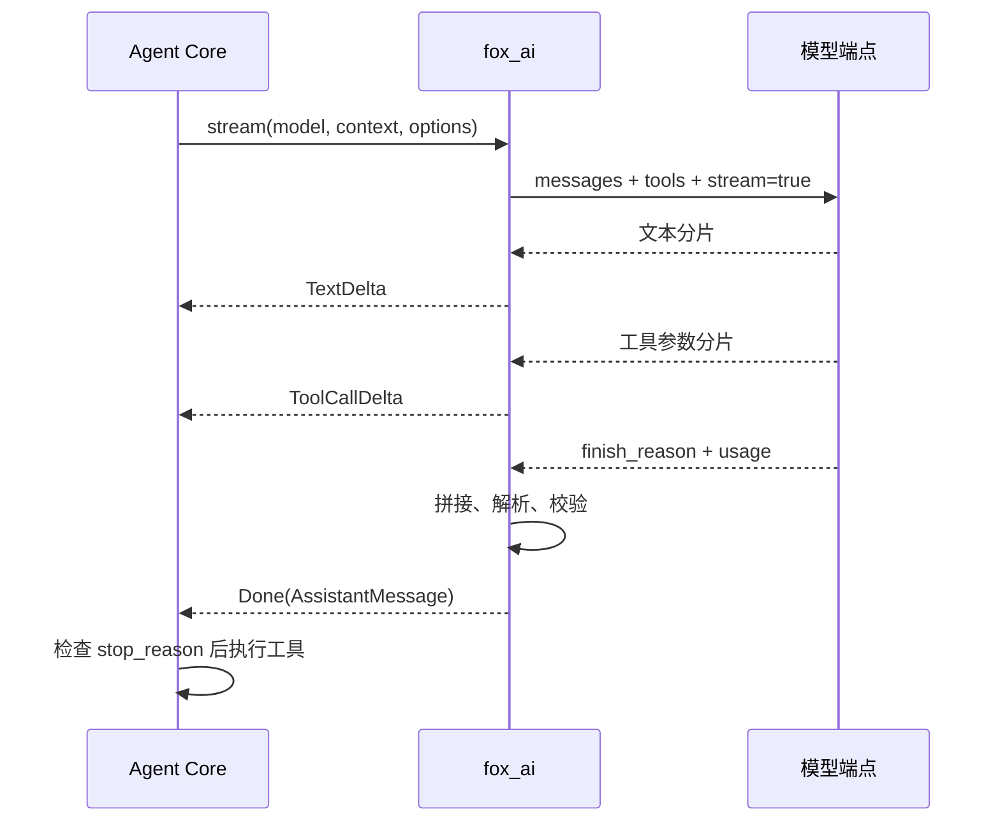

# fox_ai：模型协议与流式响应适配

[返回学习索引](README.md) · 下一篇：[Agent Core](AGENT_CORE.md)

学习目标：能把一次模型调用拆成请求转换、增量接收、工具参数组装和最终消息校验；能解释为什么页面上出现文字，并不代表这轮响应已完整结束。


图中上排是请求，下排是响应。`fox_ai` 的终点是完整 `AssistantMessage`；执行文件操作属于下一层 `fox_agent_core`。

## 1. 这一层为什么单独存在

Agent 需要统一的消息类型，但模型端点采用 HTTP JSON 协议。适配器负责把内部对象转换成 Chat Completions 请求，再把端点返回的分片恢复成内部事件与消息。这样主循环可以只关心“模型要求调用哪些工具”。

本仓库使用一个 OpenAI-compatible adapter。不同模型配置使用不同的 `model.id`、`base_url` 和 Key，不通过厂商类分派。具体端点是否接受 tools、reasoning、usage 和额外参数，需要以实际响应判断。

| 文件 | 读的时候回答什么问题 |
| --- | --- |
| [types.py](../../packages/fox_ai/src/types.py) | 模型、消息、工具、选项怎样表示？ |
| [events.py](../../packages/fox_ai/src/events.py) | 分片和最终消息有什么区别？ |
| [openai_provider.py](../../packages/fox_ai/src/openai_provider.py) | 请求如何转换，工具参数如何拼接？ |
| [stream.py](../../packages/fox_ai/src/stream.py) | 不需要流式 UI 时如何得到完整结果？ |
| [__init__.py](../../packages/fox_ai/src/__init__.py) | 包向上层暴露哪些入口？ |

## 2. 先认识四类边界对象

| 对象 | 关键字段 | 用途 |
| --- | --- | --- |
| `Model` | `id / base_url / context_window` | 选择模型与端点；窗口值是本地配置 |
| `Context` | `system_prompt / messages / tools` | 本次调用完整输入 |
| `StreamOptions` | `api_key / max_tokens / temperature / timeout / extra_body` | 生成设置与端点实验参数 |
| `AssistantMessage` | `content / reasoning / tool_calls / usage / stop_reason` | 分片全部拼接后的结果 |

`UserMessage` 保存用户输入；`ToolResultMessage` 通过 `tool_call_id` 关联调用。`ToolCall.arguments` 在内部是字典，在 HTTP 请求里是 JSON 字符串。这个区别解释了为什么收流时必须先拼字符串，再解析 JSON。

`Model.context_window` 不会自动发给端点，也不自动检测模型容量。`StreamOptions.api_key` 使用 `repr=False`，避免普通对象打印展示该字段；这不等于所有应用日志都有完整脱敏策略。

## 3. 请求转换：从 dataclass 到 JSON

入口是 `convert_context(context)`：

1. 有 system prompt 时放入第一条 system 消息。
2. 按原顺序转换用户、助手和工具消息。
3. tool 消息补充 `tool_call_id`。
4. assistant 的工具参数通过 `json.dumps(..., ensure_ascii=False)` 转成字符串。
5. 有 reasoning 时添加 `reasoning_content`。
6. 没有 content 且没有 tool_calls 的 assistant 被跳过，包括只有 reasoning 的消息。

示意输入：

```python
AssistantMessage(tool_calls=[
    ToolCall("read-1", "Read", {"file_path": "main.py"})
])
ToolResultMessage("read-1", "Read", "1: print(42)")
```

示意输出：

```json
[
  {
    "role": "assistant",
    "content": "",
    "tool_calls": [{
      "id": "read-1", "type": "function",
      "function": {"name": "Read", "arguments": "{\"file_path\": \"main.py\"}"}
    }]
  },
  {"role": "tool", "content": "1: print(42)", "tool_call_id": "read-1"}
]
```

这些是协议教学示例，没有调用真实模型。工具的名称、描述和参数 schema 来自 `Context.tools`，会另外放在请求的 `tools` 数组中。

## 4. 五种事件各自承担什么

| 事件 | 内容 | 上层用途 |
| --- | --- | --- |
| `TextDelta` | `delta` | 增量显示回答 |
| `ThinkingDelta` | `delta` | 单独显示端点提供的 reasoning |
| `ToolCallDelta` | `index / id / name / delta` | 传递尚未完成的工具参数片段 |
| `Done` | 完整 `message` | 主循环获得可执行的调用列表 |
| `Error` | `error` | 主循环结束本次运行并报告原因 |

`Done` 是 Python 内部边界事件。主循环消费它并产生 `model_end`；浏览器 SSE 中没有直接发送一个同名的 `done` 事件。不要把模型端点的 `[DONE]`、适配器 `Done` 和任务 `run_end` 当成同一个东西。



## 5. 多个工具调用怎样组装

假设模型同时生成 Read 和 Glob，传输顺序交错：

| 分片 | index | id / name | arguments 片段 |
| --- | --- | --- | --- |
| 1 | 1 | `b / Glob` | `{"pattern":` |
| 2 | 0 | `a / Read` | `{"file_path":` |
| 3 | 0 | 沿用已有值 | `"a.py"}` |
| 4 | 1 | 沿用已有值 | `"*.py"}` |

适配器以 index 建立 `calls` 字典，分别累积 name 和 arguments，最后按 index 排序。输出是调用 a 后调用 b，而不是按最先收到的分片排序。

JSON 解析只在流结束后执行。`{"file_path":` 不是完整 JSON；提前执行会把尚未生成完的操作误当成有效命令。最终还要求 arguments 是字典，id/name 非空。

## 6. 结束、异常与资源释放

完整模型流必须出现 `finish_reason`。连接结束但没有结束原因，会生成 `Error`；错误 JSON 也不会产生 `Done`。`length` 或 `content_filter` 可以进入最终消息，但 Agent Core 会拒绝执行这一轮的工具调用。

`usage` 有时在没有 choices 的单独分片中到达，源码先处理 usage，再跳过空 choices。最终 `Usage.input_tokens` 提供给 Context 做预算校准。

| 情况 | 当前实现行为 |
| --- | --- |
| 请求异常 | 转成 `Error("异常类型: 原因")` |
| 没有 finish reason | 转成 Error，拒绝假定成功 |
| 工具 JSON 损坏 | 转成 Error，不返回部分工具列表 |
| asyncio 取消 | finally 关闭 response；自建 client 也关闭 |
| 传入外部 client | 关闭 response，由调用方管理 client |
| 端点失败 | 自建 SDK client 的 `max_retries=0`，不自动重试 |

`timeout` 默认 120 秒。`extra_body` 原样交给 SDK，适用于显式端点实验；适配器不会为任意字段补兼容逻辑。

## 7. 不调用模型的最小练习

在仓库根目录完成 `uv sync` 后运行：

```bash
uv run python - <<'PY'
from fox_ai.src import Context, UserMessage, AssistantMessage, ToolCall, ToolResultMessage
from fox_ai.src.openai_provider import convert_context

context = Context(messages=[
    UserMessage("读 main.py"),
    AssistantMessage(tool_calls=[ToolCall("r1", "Read", {"file_path": "main.py"})]),
    ToolResultMessage("r1", "Read", "1: print(42)"),
], system_prompt="Inspect before editing.")
messages = convert_context(context)
assert messages[0]["role"] == "system"
assert messages[-1]["tool_call_id"] == "r1"
print(messages)
PY
```

随后运行：

```bash
uv run python -m pytest tests/test_ai.py -q
```

重点阅读 `test_fragmented_multiple_tool_calls_and_conversion` 和 `test_incomplete_or_malformed_stream_is_error`。前者证明分片能组装，后者证明不完整流不会冒充最终结果；它们使用模拟响应。

## 8. 排错顺序与面试讲述

没有文字：先检查端点是否返回 content；只有 reasoning 的端点会产生不同事件。文字正常但工具失败：检查 finish reason、完整 arguments、id/name，再看工具 schema。预算不准：检查 usage 是否出现，不能只看最后一个文本分片。

可以这样讲：这一层通过统一 dataclass 隔离 HTTP 协议，逐片传递展示事件，以 index 拼接工具调用，完成后解析 JSON，并把异常和正常完成区分开。它不执行工具，也不判断最终任务正确性。

练习：在 `tests/test_ai.py` 的本地副本中去掉 finish reason，预测最后一个事件；再把 arguments 改成数组，观察校验为何拒绝。源码中的校验比“页面看起来生成了答案”更能说明调用是否完整。
