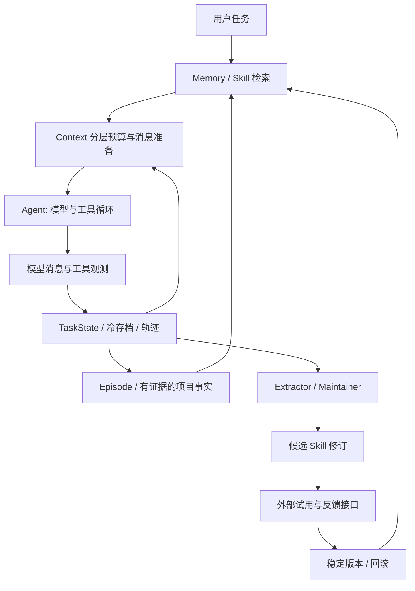

# FoxCode 三个研究模块学习路线

这套文档对应仓库中的实际实现，目的是让你能从问题、算法、源码到面试讲述完整走通。这里的“自进化”是更新外部策略库，不是更新模型权重。机制测试验证实现约束；项目收益由你在独立实验部分评估。

## 三个模块分别解决什么

| 模块 | 核心问题 | 保存的内容 | 生命周期 |
| --- | --- | --- | --- |
| Context | 下一次模型调用应看到什么，有限预算怎么分配 | 本次执行状态、选定原始消息、压缩观测、检索块 | 当前 Agent 会话 |
| Memory | 哪些过去的信息值得留给下一项任务 | 项目事实、具体任务经验、来源、有效期、文件指纹 | 跨任务持久化 |
| Skill | 如何从经验中提炼方法，并有证据地更新 | 触发条件、前置条件、步骤、验证方法、反例、版本 | 候选、独立反馈、稳定版本、归档 |

同一个例子：`Edit` 的 `old_text` 不唯一。

- Context 保留当前文件、失败信息和下一步需要重新读取文件的状态。
- Memory 保存“这个任务修改了 parser.py，遇到了匹配歧义”的具体经验。
- Skill 提炼“编辑前读取最新文件，用唯一上下文定位，编辑后复查”的可复用流程。

不能因为一条经验被记住，就认为一条策略被证明有效。

## 推荐学习顺序

1. 阅读 [Context](CONTEXT.md)：理解预算、协议配对和任务状态。
2. 阅读 [Memory](MEMORY.md)：理解证据、事实版本与多阶段检索。
3. 阅读 [Skill Evolution](SKILL_EVOLUTION.md)：理解从观察到候选，再到稳定版本的闭环。
4. 最后读 [CodingAgent](../../packages/fox_coding_agent/src/coding_agent.py)，把三个模块串起来。

第一次阅读建议分三个晚上：每晚看一份文档、跟踪一个案例、运行该模块的机制测试。第二次阅读重点手写伪代码和回答文档中的追问。

## 公共数据链路



所有研究策略位于 `fox_coding_agent`。`fox_agent_core` 只提供 Hook、工具循环和取消，`fox_ai` 只处理模型协议。

## 从一次运行看源码

| 时机 | 入口 | 做什么 |
| --- | --- | --- |
| 任务开始 | `CodingAgent.run()` | 消费上一任务的纠正窗口，检索记忆和可服务技能，登记版本 |
| 每次模型调用前 | `_before_model()` → `ContextManager.prepare()` | 选择检索块、检查预算、必要时压缩、记录实际注入 |
| 模型返回后 | `_after_model()` | 根据 usage 校准估算，更新结构化任务状态 |
| 工具返回后 | `_after_tool()` | 更新文件修订和失败证据，较长输出写入 observation 文件 |
| 任务结束 | `_save_experience()` | 保存具体 Episode、累积项目事实证据、生成候选、记录原始轨迹和审计 |
| 外部反馈 | `validate_skill()` | 检查来源隔离和实际注入版本，再更新该版本的反馈状态 |

## 运行与观察

```bash
uv run python -m pytest tests/test_research.py tests/test_research_policies.py tests/test_server.py -q
```

这些测试使用固定模型输出或本地模拟端点，不调用付费模型。它们检查消息配对、预算保护、存档、独立来源去重、版本隔离等机制。测试通过不表示任务成功率提高。

真实运行时观察前端研究面板，或调用 `GET /api/state`：

- `context.layers / decisions / retrieval_dropped`：信息分配与淘汰理由。
- `memory.statuses / retrieved[].breakdown / stale_paths`：记忆状态和召回解释。
- `skills.items[].champion_version / evolution.decisions`：候选与稳定策略的区别。
- `trajectory_id`：关联原始执行记录。

项目数据默认位于 `.foxcode/research/`。旧 Memory 表采用添加字段的升级方式，旧 Skill JSON 保留并建立版本记录；不会为了升级删除已有研究数据。

## 三分钟面试主线

> 我把 Coding Agent 的长期任务问题拆成三个互相独立的策略：Context 管理本次调用的信息预算，Memory 管理跨任务事实和经验，Skill 管理可复用的方法。Context 用完整工具协议组做渐进压缩，并保留可读取的原始观测；Memory 用项目范围、证据、版本和有效期约束检索；Skill 则把候选修订和正在服务的稳定版本分开，用外部反馈验证具体版本。三个模块通过少量 Hook 接入 Agent，而不是把主循环写成复杂框架。

讲完之后，选择一个失败→恢复案例展开，不要在三分钟内罗列所有字段。

## 能说什么、暂时不能说什么

可以说：实现了分层预算、渐进式观测压缩、带证据的事实沉淀、可解释多阶段检索、候选与稳定版本隔离、延迟纠正窗口、版本审计和回滚。

还不能说：证明了成功率提升、具备无幻觉记忆、完成了因果识别、实现了 RL、实现了 LLM 自动抽取和自动评审。当前规则阈值是研究起点，模型完成任务的文本也不是正确性证明。

本轮没有运行收益评估、SWE-bench、LLM-as-judge 或 A/B 实验。各模块文档保留了后续实验设计及指标定义，供你的其他部分使用。

`CodingAgent.run(..., learn=False)` / `/api/run` 的 `learn:false` 可关闭当前执行的知识沉淀，保留完整轨迹。显式 Skill trial 默认使用该模式，普通任务默认学习。已有知识的读取和操作性注入计数仍存在，实验侧还需要冻结版本、隔离数据库和设计数据切分。
