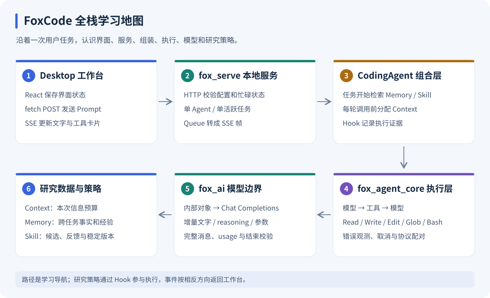
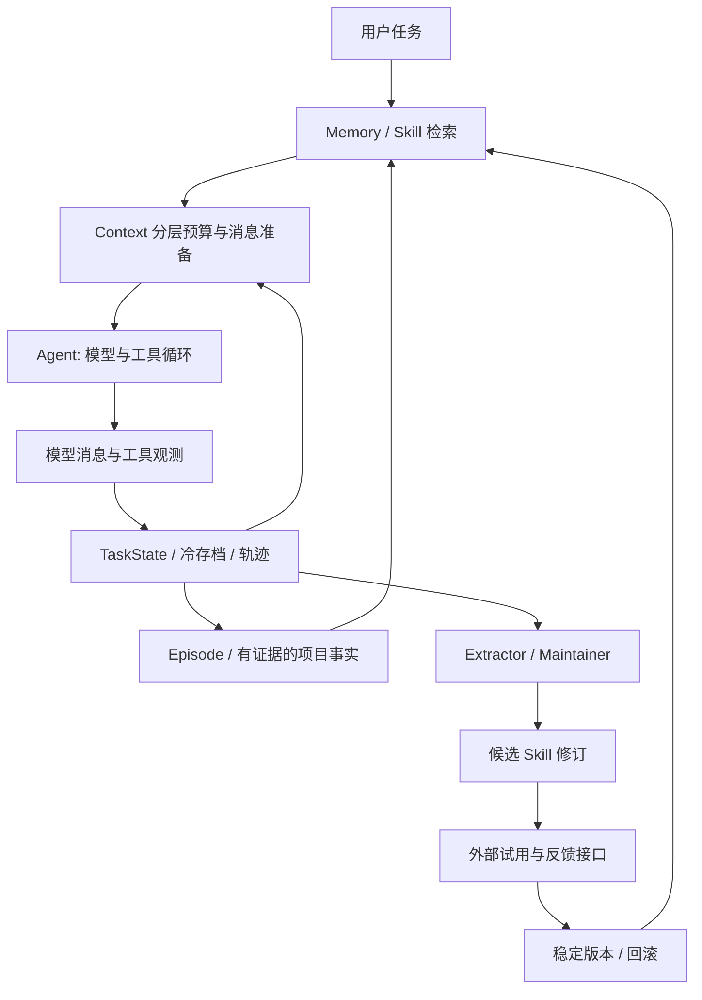

# FoxCode 全栈源码与研究模块学习路线

这套文档覆盖 `packages` 的三个 Python 包、Context/Memory/Skill 三个研究模块、`fox_serve` 服务和 `desktop` 工作台。目标是从实际操作到协议、算法、源码和面试讲述走通整个项目。

图中的流程来自本仓库实现；数值教学案例会明确标注为推演；界面图片来自已有预览。这里的“自进化”更新外部策略库，机制测试验证实现约束，项目收益需要独立实验。



图 1：先沿用户请求认识 Desktop → Serve → CodingAgent，再进入执行层、模型协议和研究策略。执行事件沿相反方向回到界面。该图是导航，不代表各模块严格串行运行一次。

## 文档导航：每个部分学什么

| 部分 | 学习文档 | 学完能解释什么 | 主要源码 |
| --- | --- | --- | --- |
| 模型适配 | [fox_ai](FOX_AI.md) | 请求转换、分片、工具 JSON、usage、结束校验 | [openai_provider.py](../../packages/fox_ai/src/openai_provider.py) |
| 执行骨架 | [fox_agent_core](AGENT_CORE.md) | 多轮模型与工具、Hook、错误观测、取消配对 | [agent_loop.py](../../packages/fox_agent_core/src/agent_loop.py) |
| 研究组装 | [fox_coding_agent](CODING_AGENT.md) | 配置、检索、注入、学习开关、轨迹生命周期 | [coding_agent.py](../../packages/fox_coding_agent/src/coding_agent.py) |
| 输入预算 | [Context](CONTEXT.md) | 校准、迟滞、完整协议组、渐进压缩 | [manager.py](../../packages/fox_coding_agent/src/context/manager.py) |
| 项目知识 | [Memory](MEMORY.md) | 证据、修订、TTL、FTS5、rerank、多样性 | [store.py](../../packages/fox_coding_agent/src/memory/store.py) |
| 策略演化 | [Skill Evolution](SKILL_EVOLUTION.md) | 规则提取、候选/稳定版、独立反馈、回滚 | [evolution.py](../../packages/fox_coding_agent/src/skills/evolution.py) |
| 本地服务 | [fox_serve](SERVE.md) | API、POST SSE、Queue、409、停止与静态挂载 | [app.py](../../fox_serve/app.py) |
| 界面与窗口 | [desktop](DESKTOP.md) | 启动、配置、UTF-8 分帧、React 时间线、Electron | [App.tsx](../../desktop/src/App.tsx) |

每篇包含源码链接、配图、实现边界和动手路线。AI、Core、CodingAgent、Context 和 Skill 文档提供可在临时数据上运行的离线脚本；Memory 第 8 节提供临时库例子。Serve/Desktop 同时给出启动方法和不请求付费模型的机制测试。

## 第一次运行：分清三个地址

```bash
# 仓库根目录：Python 依赖
uv sync
# 前端依赖与开发服务
cd desktop
npm install
npm run dev
```

| 地址 / 形态 | 用来做什么 |
| --- | --- |
| Vite Local 地址，默认 `http://127.0.0.1:5273` | 开发页面；端口占用会自动后移 |
| `http://127.0.0.1:8877/api/state` | 检查 Python 服务和研究状态 |
| `http://127.0.0.1:8877` | 构建后由 Python 提供的页面，需创建服务时已有 dist |

模型的 base_url 是另外一个地址，负责 Chat Completions，不是 Vite 地址也不是 FoxCode 服务地址。模型配置、Key 和项目目录详见 [Serve](SERVE.md) 与 [Desktop](DESKTOP.md)。

## 三个模块分别解决什么

| 模块 | 核心问题 | 保存的内容 | 生命周期 |
| --- | --- | --- | --- |
| Context | 下一次模型调用应看到什么，有限预算怎么分配 | 本次执行状态、选定原始消息、压缩观测、检索块 | 当前 Agent 会话 |
| Memory | 哪些过去的信息值得留给下一项任务 | 项目事实、具体任务经验、来源、有效期、文件指纹 | 跨任务持久化 |
| Skill | 如何从经验中提炼方法，并有证据地更新 | 触发条件、前置条件、步骤、验证方法、反例、版本 | 候选、独立反馈、稳定版本、归档 |

同一个例子：`Edit` 的 `old_text` 不唯一。

- Context 保留当前文件、失败信息和下一步需要重新读取文件的状态。
- Memory 保存“这个任务修改了 parser.py，遇到了匹配歧义”的具体经验。
- Skill 提炼“编辑前读取最新文件，用唯一上下文定位，编辑后复查”的可复用流程。

不能因为一条经验被记住，就认为一条策略被证明有效。

## 推荐学习顺序

### 路线 A：第一次读整个项目

1. 用 [Desktop](DESKTOP.md) 认识界面，再用 [Serve](SERVE.md) 理解请求和事件。
2. 读 [fox_ai](FOX_AI.md)，认识消息与完整模型结果。
3. 读 [Agent Core](AGENT_CORE.md)，离线跑一个 Write → Model 的循环。
4. 读 [CodingAgent](CODING_AGENT.md)，看四个 Hook 和轨迹。
5. 按 [Context](CONTEXT.md) → [Memory](MEMORY.md) → [Skill](SKILL_EVOLUTION.md) 读研究策略。
6. 返回 Serve/Desktop，将一次发送的每个事件映射到源码和界面。

### 路线 B：已有 Agent 基础，重点研究

直接按 Context → Memory → Skill → CodingAgent 阅读；再通过 Serve 的 API 与 Desktop 面板观察策略结果。研究数据与执行边界同样要看，不要只阅读评分公式。

### 一周学习安排

| 阶段 | 内容 | 动手产物 |
| --- | --- | --- |
| 第 1 天 | 工作台、服务、模型类型 | 画三个地址与请求方向 |
| 第 2 天 | fox_ai 与 Core | 跑离线工具循环，列事件顺序 |
| 第 3 天 | CodingAgent 与配置 | 找到 JSONL、Hook 和 learn 开关 |
| 第 4 天 | Context | 手算校准预算，解释一次 compact |
| 第 5 天 | Memory | 临时库验证来源去重与事实替代 |
| 第 6 天 | Skill | 跑 v1 stable / v2 candidate 隔离例子 |
| 第 7 天 | Serve 与 Desktop 综合 | 解释停止流程，完成三分钟讲述 |

安排是学习建议，不要求真实模型调用。首次先跑离线练习和机制测试，再根据自己的端点配置做小任务观察。

## 公共数据链路



所有研究策略位于 `fox_coding_agent`。`fox_agent_core` 只提供 Hook、工具循环和取消，`fox_ai` 只处理模型协议。

## 同一次任务的八个观察点

以“检查 parser 的失败用例”为教学任务：

| 观察点 | 代码 / 文档 | 看什么证据 |
| --- | --- | --- |
| 用户发送 | Desktop `send()` | user item、busy、trial |
| 服务准入 | Serve `run()` | 已配置、无活跃任务、prompt 非空 |
| 检索 | CodingAgent `run()` | Memory ID、Skill name/version |
| 输入准备 | Context `prepare()` | 预算、selected/dropped、压缩决策 |
| 模型调用 | fox_ai `stream()` | text/tool deltas、finish reason、usage |
| 工具执行 | Core `agent_loop()` | call ID、参数、is_error、返回 |
| 研究沉淀 | CodingAgent finally | Episode、候选与 trajectory |
| 界面收尾 | Desktop `run_end` + refresh | 完成/停止/失败与最新快照 |

真实模型可能选择不同工具序列，因此这是一组追踪位置，不是固定任务答案。

## 从一次运行看源码

| 时机 | 入口 | 做什么 |
| --- | --- | --- |
| 任务开始 | `CodingAgent.run()` | 消费上一任务的纠正窗口，检索记忆和可服务技能，登记版本 |
| 每次模型调用前 | `_before_model()` → `ContextManager.prepare()` | 选择检索块、检查预算、必要时压缩、记录实际注入 |
| 模型返回后 | `_after_model()` | 根据 usage 校准估算，更新结构化任务状态 |
| 工具返回后 | `_after_tool()` | 更新文件修订和失败证据，较长输出写入 observation 文件 |
| 任务结束 | `_save_experience()` | 保存具体 Episode、累积项目事实证据、生成候选、记录原始轨迹和审计 |
| 外部反馈 | `validate_skill()` | 检查来源隔离和实际注入版本，再更新该版本的反馈状态 |

## 运行与观察

```bash
# 仓库根目录：Python 各层机制
uv run python -m pytest tests -q
# desktop 目录：流式解析、交互与构建
cd desktop
npm test
npm run build
```

这些测试使用固定模型输出或本地模拟端点，不调用付费模型。它们检查消息配对、预算保护、存档、独立来源去重、版本隔离等机制。测试通过不表示任务成功率提高。

| 验证目标 | 测试文件 |
| --- | --- |
| 模型分片、参数与异常 | [test_ai.py](../../tests/test_ai.py) |
| 工具循环、取消与 Shell | [test_agent.py](../../tests/test_agent.py) |
| .env 和配置预算 | [test_config.py](../../tests/test_config.py) |
| 研究组装与策略 | [test_research.py](../../tests/test_research.py)、[test_research_policies.py](../../tests/test_research_policies.py) |
| HTTP/SSE 及完整本地链路 | [test_server.py](../../tests/test_server.py) |
| 前端分帧与工作台 | [api.test.ts](../../desktop/src/api.test.ts)、[App.test.tsx](../../desktop/src/App.test.tsx) |
| 包层与目录约束 | [test_architecture.py](../../tests/test_architecture.py) |

真实运行时观察前端研究面板，或调用 `GET /api/state`：

- `context.layers / decisions / retrieval_dropped`：信息分配与淘汰理由。
- `memory.statuses / retrieved[].breakdown / stale_paths`：记忆状态和召回解释。
- `skills.items[].champion_version / evolution.decisions`：候选与稳定策略的区别。
- `trajectory_id`：关联原始执行记录。

项目数据默认位于 `.foxcode/research/`。旧 Memory 表采用添加字段的升级方式，旧 Skill JSON 保留并建立版本记录；不会为了升级删除已有研究数据。

## 学习完成后的自查

- 能区分文本分片、完整 AssistantMessage、单轮 model_end 和整次 run_end。
- 能跟踪工具 call ID，从助手调用一直找到工具返回及前端卡片。
- 能解释“召回 → 注入 → 遵循 → 有效”为什么需要不同证据。
- 能从 compact 观测回到原始存档，说明预算不足的原因。
- 能演示事实来源去重、同 key 修订和 TTL 过滤。
- 能演示最新候选和稳定技能同时存在，反馈准确归属版本。
- 能说明继续发送、新任务、应用配置、learn=False 和刷新页面的差异。
- 能画出停止请求、服务取消、工具清理、SSE 结束和 UI 收尾的顺序。

配图采用可直接查看的 SVG，支持它的 Markdown 阅读器无需执行 Mermaid；正文中的 Mermaid 便于进一步追踪时序。图示与来源对照见 [配图说明](assets/README.md)。

## 三分钟面试主线

如果要介绍整个项目，先用约 40 秒讲执行链：React 通过 POST SSE 与本地 FastAPI 服务通信，CodingAgent 用 Hook 将研究策略接入工具循环，fox_ai 统一模型协议、组装工具参数和 usage；工具结果回到模型，最终事件更新界面。然后用下面的研究主线展开，最后选择一个失败恢复案例，说明配对、压缩、记忆与技能版本各自留下了什么证据。

> 我把 Coding Agent 的长期任务问题拆成三个互相独立的策略：Context 管理本次调用的信息预算，Memory 管理跨任务事实和经验，Skill 管理可复用的方法。Context 用完整工具协议组做渐进压缩，并保留可读取的原始观测；Memory 用项目范围、证据、版本和有效期约束检索；Skill 则把候选修订和正在服务的稳定版本分开，用外部反馈验证具体版本。三个模块通过少量 Hook 接入 Agent，而不是把主循环写成复杂框架。

讲完之后，选择一个失败→恢复案例展开，不要在三分钟内罗列所有字段。

## 能说什么、暂时不能说什么

可以说：实现了分层预算、渐进式观测压缩、带证据的事实沉淀、可解释多阶段检索、候选与稳定版本隔离、延迟纠正窗口、版本审计和回滚。

还不能说：证明了成功率提升、具备无幻觉记忆、完成了因果识别、实现了 RL、实现了 LLM 自动抽取和自动评审。当前规则阈值是研究起点，模型完成任务的文本也不是正确性证明。

本轮没有运行收益评估、SWE-bench、LLM-as-judge 或 A/B 实验。各模块文档保留了后续实验设计及指标定义，供你的其他部分使用。

`CodingAgent.run(..., learn=False)` / `/api/run` 的 `learn:false` 可关闭当前执行的知识沉淀，保留完整轨迹。显式 Skill trial 默认使用该模式，普通任务默认学习。已有知识的读取和操作性注入计数仍存在，实验侧还需要冻结版本、隔离数据库和设计数据切分。
