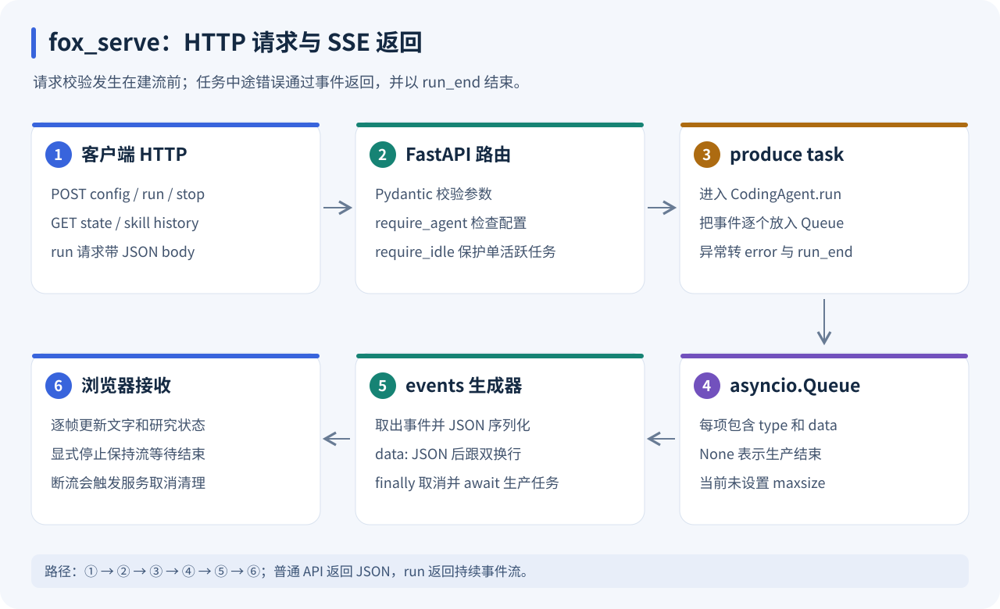
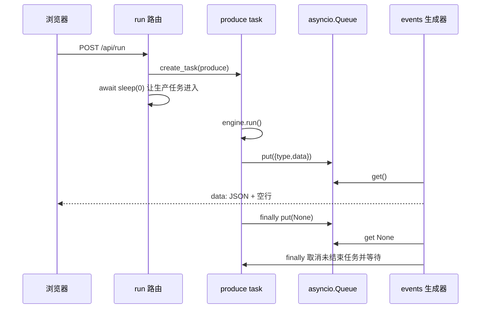
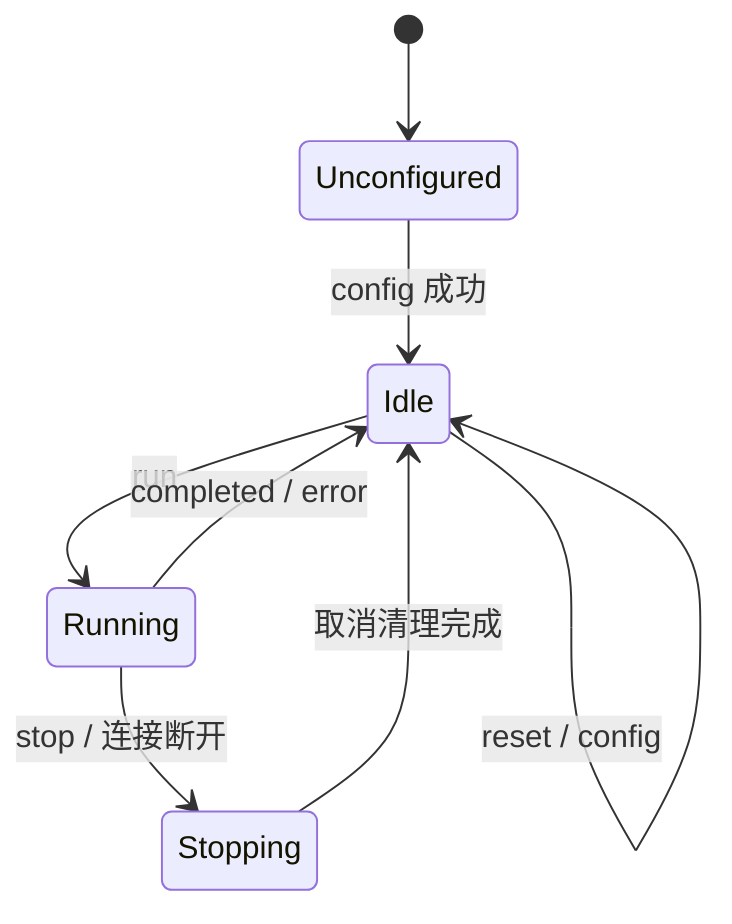

# fox_serve：本地 HTTP API、SSE 与任务生命周期

[返回学习索引](README.md) · 前置：[CodingAgent](CODING_AGENT.md) · 下一篇：[Desktop](DESKTOP.md)

学习目标：能独立启动服务、配置项目、读取状态、观察流式事件；能从源码解释单任务限制、停止、断流、重置和静态页面的行为。



上排是请求路径，下排是事件返回路径。普通 API 返回一次 JSON；`POST /api/run` 保持响应流并不断返回事件。

## 1. 两个文件构成整个服务入口

| 文件 | 责任 | 推荐阅读位置 |
| --- | --- | --- |
| [__main__.py](../../fox_serve/__main__.py) | 参数、环境配置、Uvicorn | `main()` |
| [app.py](../../fox_serve/app.py) | 请求模型、路由、任务、SSE、静态挂载 | `create_app()` |

`create_app()` 闭包内保存 `coding` 和 `active`。没有按浏览器分别创建的会话：同一服务进程中的多个页面共享同一个 CodingAgent。当前入口默认单进程、监听 `127.0.0.1`，端口 8877；不应通过增加 worker 来假定它会自动变成多会话服务。

## 2. 三种启动方式

前提：Python 3.12+ 和 uv，在仓库根目录执行 `uv sync`。

### 方式 A：前后端一起启动

```bash
cd desktop
npm install
npm run dev
```

脚本检测 8877 的 `/api/state`，可复用现有服务，否则启动 Python；然后启动 Vite。页面地址以终端 Local 输出为准，默认 5273，端口占用时会向后尝试。

### 方式 B：单独启动后端，再用页面配置

在仓库根目录：

```bash
uv run python -m fox_serve --cwd . --port 8877
```

若没有 `--model` 或 `FOX_MODEL`，服务仍能启动，`GET /api/state` 返回 `configured:false`。此时运行任务返回 400，需要先配置。

### 方式 C：由环境启动已配置的服务

```bash
export FOX_MODEL=your-model-id
export FOX_BASE_URL=https://your-endpoint/v1
# FOX_API_KEY 在本机环境或 .env 中设置
uv run python -m fox_serve --cwd /absolute/path/to/project
```

`.env` 的实际查找规则见 [CodingAgent 配置](CODING_AGENT.md)。不要把示例占位模型当成真实可用模型。Windows PowerShell 的变量写法是 `$env:FOX_MODEL="your-model-id"`。

入口只提供 `--cwd / --model / --base-url / --port`。改成非 8877 后，desktop 默认代理及自动启动脚本仍指向 8877，需要对应调整开发配置；前端不会自动探测新端口。

## 3. 服务可达和模型可用是两件事

```bash
curl -sS http://127.0.0.1:8877/api/state
```

初始响应可以只有：

```json
{"configured": false}
```

配置示例，`cwd` 请替换为本机实际目录；Key 可由 `.env` 提供：

```bash
curl -sS http://127.0.0.1:8877/api/config \
  -H 'Content-Type: application/json' \
  -d '{"cwd":"/absolute/path/to/project","model":"your-model-id","base_url":"https://your-endpoint/v1","context_budget":12000}'
```

应用配置只构造 CodingAgent、打开研究存储，不发送一次模型健康检查。收到 `configured:true` 表示本地组装完成；端点鉴权和模型兼容性会在实际运行时检验。

## 4. 完整 API 地图

表中“需空闲”对应实际 `require_idle()` 调用；FastAPI/Pydantic 也会在进入路由前校验请求。

| 方法与路径 | 请求 / 关键返回 | 需配置 | 需空闲 |
| --- | --- | --- | --- |
| GET `/api/state` | `configured` 加 snapshot | 否 | 否 |
| POST `/api/config` | 配置请求 → 新 snapshot | 否 | 是 |
| POST `/api/run` | `prompt, trial_skill?, learn?` → SSE | 是 | 是 |
| POST `/api/stop` | `{stopped:true}` | 否 | 否 |
| POST `/api/reset` | 重建当前配置的 Agent → snapshot | 是 | 是 |
| POST `/api/memory` | 添加记录 → `{id}` | 是 | 否 |
| POST `/api/memory/invalidate` | `id, reason` → Memory 记录 | 是 | 是 |
| GET `/api/skills/{name}/history` | 版本与事件 | 是 | 否 |
| POST `/api/skills/validate` | 反馈 → Skill 记录 | 是 | 是 |
| POST `/api/skills/rollback` | 切稳定指针 → Skill 记录 | 是 | 是 |

注意：添加 Memory 当前没有 require_idle，因此它与修改配置的限制不同；但当前任务的 Memory 检索已经在 run 开始时完成，新条目通常到下个任务才进入召回。

### 配置请求字段

| 字段 | 默认 | 说明 |
| --- | --- | --- |
| `model` | 必填 | Config 再校验非空 |
| `cwd` | `.` | 相对于服务进程启动目录解析 |
| `base_url` | OpenAI `/v1` 地址 | HTTP 模型里为字符串 |
| `api_key` | null | 保留当前 Key；首次配置从项目环境取 |
| `context_budget` | 12000 | 输入预算 |
| `context_window` | 32768 | 本地总窗口配置 |
| `max_tokens` | 4096 | 输出预算 |
| `max_turns` | 30 | 模型调用轮数上限 |

页面仅提交其中 model、cwd、base_url、api_key、context_budget；其他项由 API 默认值补齐。HTTP 配置不整体继承 `FOX_CONTEXT_BUDGET` 等环境默认。

Key 的细节：页面空输入转为 null；API 的 null 保留旧 Key。直接调用 API 传 `"api_key":""` 会明确设为空字符串，不能把空字符串和 null 混同。切项目且传 null 时，已配置服务优先保留旧 Key，不会自动切到新项目 `.env` 的 Key。

新 Agent 构造成功才关闭旧 Agent；目录错误或预算错误返回 400，旧配置继续存在。成功应用配置会重建 Context。

### 记忆请求字段

```json
{
  "content": "项目使用 uv 管理 Python 依赖",
  "memory_type": "semantic",
  "verify": true,
  "key": "dependency-manager",
  "ttl_days": 30
}
```

content 非空；ttl_days 若提供必须大于 0。source 固定为 user，scope 是当前项目，confidence=1。同一 scope/key 的不同内容形成修订。页面添加入口目前只提交 content，使用其余默认值。

### 技能反馈与回滚字段

```json
{"name":"edit-recovery","trajectory_id":"实际轨迹 ID","useful":true,"saved_calls":0}
```

saved_calls 请求值必须非负，内部反馈进一步限制单次贡献。轨迹必须存在，技能必须实际注入，并通过来源/版本检查。history 可回查来源；回滚请求为 `name, version, reason`，version 至少 1，目标需是已验证可回滚版本。

## 5. POST SSE：为什么不是普通 JSON

一次任务可能先生成文字，再读文件，再执行测试，再总结。等待全部结束才一次性返回，会掩盖中途活动。当前 run 使用 `StreamingResponse`，每个事件格式为：

```text
data: {"type":"text_delta","data":{"delta":"正在读取"}}

data: {"type":"run_end","data":{"status":"completed","trajectory_id":"..."}}

```

每帧以两个换行结尾。事件类型在 JSON 的 `type` 内，不使用 SSE 的 `event:` 字段。浏览器采用 fetch POST 读取流，支持 JSON body 和 AbortSignal，详见 [Desktop 分帧器](DESKTOP.md)。

服务设置 `Content-Type: text/event-stream`、`Cache-Control: no-cache`、`X-Accel-Buffering: no`。这有助于流式到达，但第三方代理是否缓冲仍由代理配置决定。

### 事件对照表

| 事件 | data 的关键字段 | 意义 |
| --- | --- | --- |
| `run_start` | 通常为空 | Core 开始运行 |
| `model_start` | `turn` | 一次模型调用开始 |
| `text_delta` | `delta` | 正文片段 |
| `thinking_delta` | `delta` | reasoning 片段 |
| `tool_call_delta` | `index, id, name, delta` | 尚未完成的参数片段 |
| `model_end` | `message` | 完整助手消息 |
| `tool_start` | `call` | 即将执行工具 |
| `tool_end` | `call, result` | 工具结果，含 is_error |
| `research_state` | snapshot | Context/Memory/Skill 展示状态 |
| `error` | `error` | 错误信息，仍应继续等待 run_end |
| `run_end` | `status`，正常组合层结束还带 trajectory_id | completed / cancelled / error |

`research_state` 在 `model_start` 和 `tool_end` 后，以及正常组合层结束时发送。它不是固定秒数轮询。服务异常兜底的 run_end 可能仅带 status，因此需要时再读 `/api/state`。

## 6. Queue 怎样连接执行与网络



Queue 解耦 Agent 产出事件和网络读取。`None` 是进程内部的结束标记，不发送成 SSE。当前 Queue 没有设置 maxsize，因此文档不能宣称有基于队列容量的背压或固定内存上限。

启动后 `sleep(0)` 很短，目的在于让 produce 进入自己的 try/finally，避免刚建 task 就被并发 stop 取消而没机会入队结束标记。

## 7. 忙碌、停止与断开连接



这是解释行为的示意状态图，源码没有同名枚举。闲置状态下 active 可以仍指向已结束的 task；require_idle 看的是 `active and not active.done()`。

| 用户动作 | 服务动作 | 页面可观察结果 |
| --- | --- | --- |
| 运行中再次 run | 409 | 原任务继续 |
| 运行中 config/reset | 409 | 等停止后再操作 |
| 点击停止 | 取消 active 并 await | 原 SSE 接收 cancelled 结束 |
| 关闭页面 / abort 流 | events finally 取消并等待 | 当前连接不能再可靠读到结束帧 |
| 服务正常关闭 | lifespan 先 stop，再 close 数据库 | 已写入研究数据保留 |

显式停止不会直接调用浏览器 abort。它让客户端继续读取流，确认工具清理和任务结束。断流取消是服务清理策略，不是“后台继续执行并提供稍后重连历史”。当前无事件重放、Last-Event-ID 或断点续传。

## 8. 用 curl 观察真实流

这一步使用你配置的模型，会执行真实任务。选择可独立检查的小任务：

```bash
curl -N http://127.0.0.1:8877/api/run \
  -H 'Content-Type: application/json' \
  -d '{"prompt":"列出当前项目的顶层目录并解释入口文件","learn":false}'
```

`-N` 关闭 curl 输出缓冲。另一个终端可以停止：

```bash
curl -sS -X POST http://127.0.0.1:8877/api/stop
```

观察时记录：第一个 text_delta 是否在任务结束前到达；tool_start/end 是否使用同一 call ID；末帧是否为 run_end。不要把这些协议检查当成答案正确性评估。

## 9. 静态页面与开发代理

| 运行形态 | 页面由谁提供 | API 去向 |
| --- | --- | --- |
| 开发 | Vite，默认 5273 | `/api` 代理到 8877 |
| 构建后 | FastAPI 挂载 desktop/dist | 同一 8877 的 API |
| Electron | 窗口加载已有 HTTP 页面 | 页面仍使用 HTTP/SSE |

在 desktop 执行 `npm run build`，再启动或重启服务，访问 `http://127.0.0.1:8877`。create_app 只在创建时检测 dist；如果服务启动时还没有 dist，之后构建不会自动添加挂载。

API 路由先注册，根目录静态挂载在最后，因此静态页面不会取代 `/api/state` 等既有路由。

## 10. 按错误层级排查

| 现象 | 先检查 | 对应代码 |
| --- | --- | --- |
| 无法连接 8877 | Python 进程、端口、启动日志 | __main__.py |
| 400 未配置 | `/api/state.configured` | require_agent |
| 400 配置失败 | cwd 是否存在，预算是否有效 | Config / configure |
| 409 | 原任务是否仍在执行 / 清理 | require_idle |
| 422 | 请求字段缺失、类型、min_length、数值范围 | Pydantic 请求模型 |
| 404 Memory/Skill | ID / 名称是否属于当前库 | invalidate / history |
| HTTP 200 但任务失败 | SSE error 和 run_end | produce / Agent |
| 页面根地址 404 | 创建服务时是否已有 dist | static mount |
| run 看似有文字却未完成 | finish reason、端点超时、run_end | fox_ai 与 SSE |

run 返回 HTTP 200 只是流建立成功；后续任务错误在事件流内表达。路由入参错误才通常在建流前返回非 200。

## 11. 不调用付费模型的机制验证

```bash
uv run python -m pytest tests/test_server.py -q
```

| 测试 | 验证重点 |
| --- | --- |
| `test_configuration_state_reset_and_memory` | 配置、状态、密钥不回传、重置保留 Memory |
| `test_configuration_uses_project_dotenv_key` | 项目 .env Key 的实际传递 |
| `test_live_sse_stop_and_busy_guard` | 真实本地 HTTP 的逐片到达、409、取消 |
| `test_http_to_sdk_to_tool_to_sse` | 本地模型端点 → SDK → Write → SSE 完整链路 |
| `test_memory_revisions_and_skill_history_rollback_api` | 事实替代、失效、历史、回滚 |

这些测试使用假模型或本地模拟端点。它们证明传输和生命周期机制，不证明任务成功率或任意模型兼容性。

练习：画出 stop 与 events finally 的两条取消路径；解释为什么 stop 返回后仍要继续读原流；对照表检查哪些修改接口需空闲。进一步做多会话服务时，首先需要显式的实例/任务隔离，而不是只增加 worker 数量。
