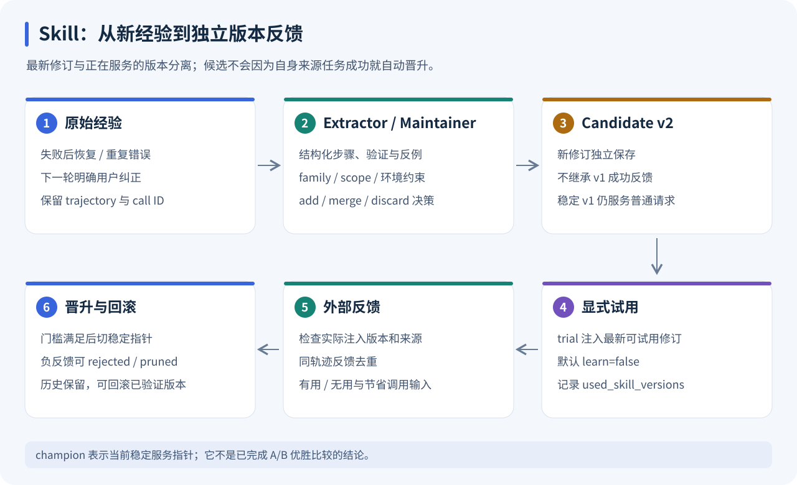
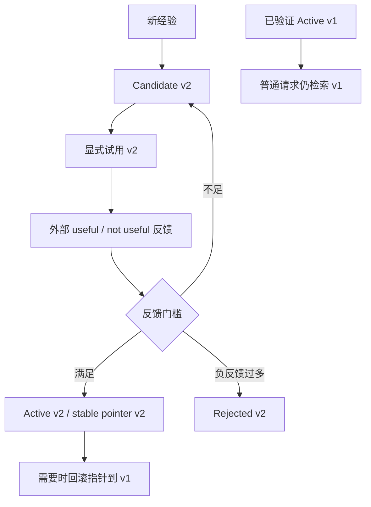
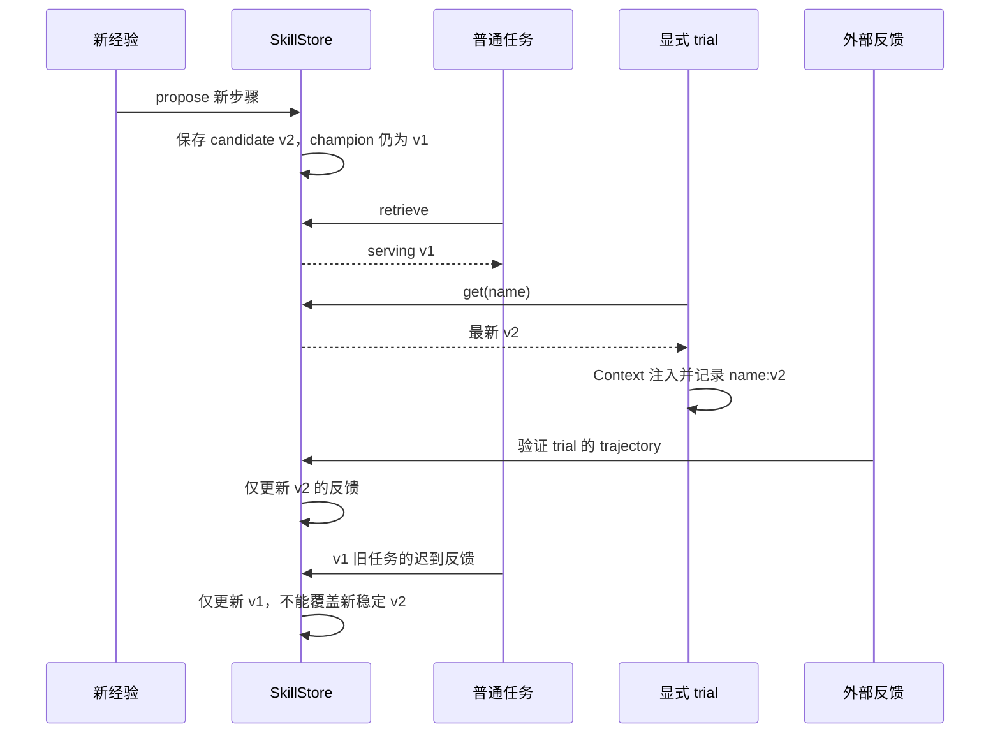

# Skill Evolution：从证据到可回滚策略版本

[返回学习索引](README.md) · 前置：[CodingAgent](CODING_AGENT.md) · 关联：[Serve](SERVE.md)、[Desktop](DESKTOP.md)

学习目标：能解释提取、维护、候选、试用、反馈和稳定版本的完整链路，并从轨迹确定反馈究竟更新了哪一版。



图中 v2 是最新修订，v1 是已有稳定版。普通检索与显式试用可以选择不同版本，实际注入记录是反馈归属的依据。

## 1. 先定义“自进化”的边界

这里改变的是模型外部的可复用策略库：触发条件、前置条件、操作步骤、验证方式和反例。没有训练模型参数，也没有把试用结果直接当奖励做 RL。

设计需要回答：从什么经历抽取？凭什么认为是可复用方法？怎样避免重复？修改旧方法时怎样不破坏已经有证据的版本？谁提供有效性结论？

本项目把这些问题分成 Extractor、Maintainer、版本存储、外部反馈四个部分。当前 Extractor/Maintainer 使用确定性规则；LLM 策略抽取与效果评判保留为后续研究设计。

## 2. 从 BearCode 参考了什么

原有设计记录列出的 BearCode 参考入口如下。该外部项目未包含在本仓库中，本篇的实现说明以 FoxCode 源码为准：

- `agents/online_skill_evolution.py`：候选抽取、add/merge/discard、在线来源记录。
- `agents/skill_evolution.py`：创建/修改、版本历史、usage 和 provenance。
- `agents/skills.py`：轻量检索与技能提示。
- `wiki/Skills自进化逻辑与实现思路.md`：pending window 与下一轮用户反馈。

| BearCode 思路 | FoxCode 本轮实现 | 取舍 |
| --- | --- | --- |
| pending window | 项目 scope 下持久化上一完成任务的有界窗口 | 下一次纠正能够关联旧任务，重启不会完全丢掉等待反馈的来源 |
| Extractor / Maintainer 分开 | `extract_experience()` 与 `maintain()` | 规则可读；未来可比较 LLM 抽取，不默认增加付费 side query |
| add / merge / discard | family、scope、environment 身份门槛，加结构化步骤合并 | 不用相似文本分数单独授权自动改已有策略 |
| history / provenance | version payload、事件表、experience 引用、原始轨迹 | SQLite 作为权威数据源，不同时维护几份容易分叉的状态 |
| usage stats | retrieved / injected / 外部 useful 反馈分开 | 没有启发式把“回答提到了技能名”当作真正采用 |
| 技能修改 | 新候选版本 + 独立 champion 指针 | 新策略待验证时，旧稳定策略继续服务 |

没有复制 BearCode 的权限框架、fork 子 Agent、在线评测运行器或 champion 性能比较系统。本轮沿用薄 Agent Harness。

## 3. Skill 是结构化方法，不是日志拼接

源码：[store.py](../../packages/fox_coding_agent/src/skills/store.py)。

一个 Skill 包含：

```text
name / description / trigger / tags
scope / environment / family
preconditions: 在什么前提下可用
procedure: 具体步骤
verification: 怎么检查执行后的结果
anti_patterns: 不应重复什么
instructions: 给模型的步骤文本
experiences: 失败/恢复或用户纠正的来源
source_trajectory / version / status
feedback counts / confidence / confidence_lower
retrieved_count / injected_count
```

例如 `Edit old_text` 匹配失败，不应该保存整个旧文件正文，而是抽取：

```text
触发：Edit 因匹配不唯一或不存在而失败
前置：读取最新文件，确认失败原因一致
步骤：用唯一的 old_text，上下文消歧，进行局部修改
验证：重新读取修改区域，运行对应检查
反例：用历史 old_text 盲目重试
证据：原失败 call ID、后续成功 call ID、来源任务
```

失败参数中的内容正文只记录类型与长度，命令等短证据经过基础脱敏。它不是完整 DLP，也不能保证所有一次性信息都被识别，所以自动结果仍先进入 Candidate。

## 4. Extractor：把失败恢复变成可检验假设

源码：[evolution.py](../../packages/fox_coding_agent/src/skills/evolution.py)。

当前观察三类信号：

1. 同工具、同资源/命令家族在有限窗口内失败后采用不同参数成功。
2. 相同错误签名重复出现，提示需要改变重试策略。
3. 用户以 `纠正：`、`correction:` 等明确纠正标记提供规则。

失败粗分为 missing-resource、edit-mismatch、shell-syntax、timeout、permission、test-failure；未知错误保留一个独立签名。对 Edit 等已识别原因使用结构化步骤模板。

```text
pytest 失败 -> 修复后 pytest 成功
  -> 可提取一个候选
pytest 失败 -> echo ok 成功
  -> 不作为该测试失败的恢复
```

Bash 匹配至少要求命令家族一致，距离不超过 8 个工具步骤，参数发生变化。这减少伪关联，但仍不足以判定因果。证据里明确写 `causality=candidate_hypothesis`。

目前没有通用根因诊断，也没有根据轨迹自动生成任意高质量 workflow。对已知工具错误生成候选，是一个可运行、可审计的起点。

## 5. 为什么下一轮反馈值得单独处理

模型自己说“修好了”不意味着用户认可。完成一个任务后，将 prompt、scope、environment、版本引用保存在 `evolution_pending`。

下一次允许学习的输入：

```text
上一任务 t1 -> pending
用户 t2：纠正：必须先检查当前 shell，再设置环境变量
  -> 来源同时关联 t1 和 t2
  -> 形成待验证候选
```

普通“谢谢”、新任务请求不会自动被算成有效反馈；窗口会消费一次。每个 scope 只保留最近一个允许学习的完成任务窗口，prompt 限制长度，并非无限保存对话。`learn=False` 的试用任务不消费、不替换这个窗口。

这建立了来源关系，没有自动给上一技能扣分或加分。真正的 usefulness 仍来自显式验证接口。当前不是对任意自然语言反馈做语义分类。

## 6. Maintainer：控制知识库规模与误合并

`maintain()` 查找同名候选或相同 family/scope/environment 的既有策略。

```text
找不到同身份策略 -> add
同身份且步骤相同 -> merge evidence，不增加成功计数
同身份且新增步骤 -> 保留已有步骤、去重合并、创建候选修订
无可安全合并的结构，或候选过长/为空 -> discard
```

来源和环境是硬约束，词面相似度本身不允许修改已有规则。按 family 合并能减少“同一个 Edit 工作流换个名字又创建一个”的重复。

当前步骤合并采用去重和长度上限，没有一般性的语义冲突求解。例如两条复杂策略分别要求“必须执行 X”和“绝不能执行 X”，需要未来更强的 Maintainer 或人工修订；不能把规则拼接包装成已解决语义矛盾。

## 7. 新候选与稳定版本必须分离

这是本轮最关键的版本机制：



四个主要表：

| 表 | 保存内容 |
| --- | --- |
| `skills` | 每个技能最近的修订，便于查看 Candidate |
| `skill_versions` | 每个 `(name, version)` 的内容与反馈状态 |
| `skill_champions` | 当前普通请求可检索的稳定版本指针 |
| `skill_events` | add、revise、feedback、promote、prune、rollback 等来源事件 |

`get(name)` 查看最新修订；`serving(name)` 查看稳定版本。v2 尚待验证时，不会把 v1 的 instructions 就地改成 v2，也不会把 v1 的成功反馈搬给 v2。

同版本 instructions 不允许更改。其他行为约束字段也应随修订处理。反馈计数可以更新，但旧版本的策略文本保留供审计。

## 8. 实际注入版本是验证的依据

每次轨迹记录：

```json
{
  "retrieved_skills": [{"name": "edit-recovery", "version": 1}],
  "used_skills": ["edit-recovery"],
  "used_skill_versions": {"edit-recovery": 1}
}
```

`used_skills` 保留既有 API 字段名，其准确语义是“至少一次模型请求实际注入”，不是“已经证明模型遵循了策略”。`skill_usage` 以 name/version/trajectory/stage 去重，重复模型调用不制造多次任务级注入。

若任务运行时注入 v1，任务结束时已经有候选 v2，迟来的反馈只能记录在 v1。旧轨迹缺少版本字段时，发生修订后会拒绝模糊验证，避免错误给最新版本加分。

还要检查：候选提取来源不能证明自身；同一轨迹不能重复计数；正反馈要求完成的轨迹；HTTP 验证要求该 Skill 确实被注入。

为减少验证数据回流，`run(prompt, learn=False)` 只检索和执行，不沉淀新的 Memory、Candidate 或待纠正窗口，仍保留轨迹和召回/注入统计。显式 `trial_skill` 默认 `learn=False`，普通任务默认 `True`；研究者可显式覆盖。API 支持同名字段。这不是完整冻结框架，但能避免一次 held-out 试用顺便变成新训练来源。

## 9. 反馈统计与生命周期

反馈来自外部实验或人工判断。这里不运行自动评测，不比较有无 Skill 的反事实收益。

```text
posterior_mean = (success_count + 1) / (success_count + failure_count + 2)
utility = success_count - 2 * failure_count + reported_saved_calls
```

成功/失败计数的含义是外部 useful/not useful 标签。每次报告的节省调用数限制在 0..5，防止单条夸大的 savings 完全支配 utility；它仍是外部输入，没有在本模块测量。

状态门槛：

| 条件 | 状态 |
| --- | --- |
| 新修订 | Candidate，反馈重置 |
| 至少 2 个不同反馈轨迹且 mean ≥ 0.6 | Active |
| 至少 5 个正反馈且 mean ≥ 0.7 | Mature |
| 至少 2 个负反馈且 utility ≤ 0 | Candidate → Rejected；活跃版本 → Pruned |
| 稳定版本 utility ≤ 0，或超过 90 天未获得反馈且 utility < 3 | Pruned |

另外提供 Wilson 95% 下界 `confidence_lower`。它用样本数表达不确定性，例如 2/2 并不意味着下一次一定成功。检索时给这个下界一个小奖励，晋升仍用上述可见门槛。

Beta mean 和 Wilson interval 的统计解释依赖 Bernoulli/独立抽样假设，而用户任务与反馈可能相关，所以这里只把它们作为可解释证据统计，不声称得到校准正确的真实成功概率。

`champion` 在代码里表示已过反馈门槛、当前用于服务的版本，不表示它在 A/B 比较中击败了所有版本。实验侧可以使用独立数据集决定反馈或显式回滚。

## 10. 检索：先检查适用，再比较相关

普通请求只召回稳定 Active/Mature 版本。Candidate 必须通过 `run(..., trial_skill=name)` 明确试用。

检索顺序：

1. scope 符合当前项目，或 Skill 未限制 scope。
2. 声明的 environment 键与运行环境一致。
3. 元信息加权 BM25 风格评分。
4. 加少量 `confidence_lower` 奖励。
5. 每个 family 最多一个，取 top-3。
6. Context 分配 token 预算，决定最终注入。

触发条件/名称标签权重较高，正文低权重参与。这里对每个字段做基础去重 token 后计算加权词频，不是外部搜索引擎或 embedding 检索。

环境字段目前只有 platform 和执行 shell，当前 Windows Bash 工具实际用 cmd.exe，不应把 IDE 的 PowerShell 提示符当成执行 shell。Python/package 版本等更多环境维度可由后续实验设计加入。

自然语言 preconditions 作为模型提示，不是形式化约束验证器。显式 trial 允许研究者主动测试适用性，普通自动检索则做已有的 scope/environment 门槛。

## 11. 回滚与审计

```text
GET /api/skills/{name}/history
POST /api/skills/rollback {name, version, reason}
```

只能切换到已经 Active/Mature 的版本。回滚改变 serving 指针，最新 Candidate/修订和历史证据仍保留，不复制旧反馈伪造一个新版本。旧版已归档时，需要新候选重新验证。

可以通过 event source 回到 trajectory，再定位 failure_call_id 与 recovery_call_id。完整审计链回答“为什么新增、为什么改、验证的是哪一版、为什么回滚”。

## 12. 跟着源码走一遍

```text
CodingAgent.run
  -> consume_feedback
  -> SkillStore.retrieve / 显式 trial
  -> Context.prepare
  -> mark_usage(injected)
  -> tools / 原始轨迹
  -> SkillEvolution.observe
     -> extract_experience
     -> maintain
     -> SkillStore.propose
  -> 外部 validate_skill
     -> exact version / source checks
     -> SkillStore.record
     -> champion pointer
```

```bash
uv run python -m pytest tests/test_research_policies.py -q -k 'skill or serving or feedback'
```

测试验证的是假设数据下的版本和门槛机制，不是策略泛化效果。

## 13. 尚未实现的 LLM 抽取设计

如果未来替换规则 Extractor，建议只让 LLM 输出结构化 proposal：

```text
trigger, preconditions, procedure, verification, anti_patterns
source_trajectory, cited_call_ids, cause_hypothesis
```

本地逻辑验证引用 call ID 确实存在、成功结果没有伪造、输出长度受限，再进入 Candidate。Maintainer 的模型建议与实际执行决策分开记录；merge 需要完整可审查的新正文。任何模型输出都不能直接覆盖 serving 版本或自报成功晋升。

这个接口是研究方案，当前没有调用 side_query。你可以在其他部分评估规则 Extractor 与 LLM Extractor，再决定是否接入。

## 14. 面试追问

**这和保存 Prompt 模板有什么不同？** 多了提取来源、适用前提、独立版本、注入记录、外部反馈门槛、稳定版本指针、审计和回滚，是一个经验到策略的更新过程。

**失败后成功就证明策略有效吗？** 不证明，先产生因果假设候选。修改后的策略要在非提取来源、实际注入该版本的轨迹上接受外部反馈。

**怎么避免越进化越差？** 候选修订与 serving 隔离，旧版继续服务；新版本不继承成功计数；负反馈和 stale 规则可归档；提供已验证版本回滚。

**怎么证明被模型用了？** 注入只能证明模型有机会看到，不能证明遵循。需要外部判分或轨迹标注，所以统计分开。

**算在线学习或 RL 吗？** 它是运行过程中的外部策略沉淀，可说 experience-driven adaptation；没有梯度更新、policy optimization 或经过验证的 verbal RL 实验。

## 15. 外部评估接口与尚未运行的实验

建议冻结：任务 ID、数据切分、提取来源、候选内容 hash、实际注入版本、环境、随机种子、工具调用和外部 verifier 结果。

比较：无 Skill、只有人工 Skill、规则候选、增加下一轮反馈、增加版本门槛、未来 LLM 候选。对固定任务分别运行 with/without Skill，分析正确性、工具次数、成本、负迁移，而不是把一次 completed 当作有效。

`useful/saved_calls` 只是外部反馈入口。本轮没有运行这些评估、没有生成收益数字，也没有实现 BearCode 的在线效果评测系统。

## 16. 手算反馈门槛与负反馈

假设一个全新的 Candidate，每次反馈来自不同、非提取来源的实际注入轨迹，saved_calls=0。以下数值是按代码公式推演：

| 正 / 负反馈 | posterior mean | utility | 结果 |
| --- | --- | --- | --- |
| 0 / 0 | 按公式为 .5；新候选存储 confidence 初始为 0 | 0 | candidate |
| 1 / 0 | 2/3≈.667 | 1 | candidate，正反馈数还不足 |
| 2 / 0 | 3/4=.75 | 2 | active，可建立稳定指针 |
| 5 / 0 | 6/7≈.857 | 5 | mature |
| 新候选 0 / 2 | 1/4=.25 | −4 | rejected |
| 已 active，后来累计 2 / 2 | 3/6=.5 | −2 | pruned |

重复 trajectory 不会让反馈数继续增加。saved_calls 只有正反馈时累积，单次限制在 0..5；它不由服务自动测量。

新候选的 confidence 初始值与第一次反馈后使用的 posterior mean 要分开理解，不能把数学先验计算结果误当成当前存储字段。

## 17. v1 稳定、v2 候选时究竟发生什么



最后一步以 v2 已晋升为前提。源码 record 不会因旧版迟来的正反馈把较新的已批准版本替换回旧版；显式 rollback 则是有理由、有历史的操作。

前端卡片展示最新修订，不等于上次普通任务用的版本。正确路径：`trajectory.used_skill_versions` → `skill_versions` → `skill_events`。页面的“有效”按钮使用轨迹 ID，后端定位版本。

## 18. 可离线运行的版本隔离例子

这段只演示 SkillStore 的数据与门槛，不运行任务。直接调用 record 会绕过 CodingAgent 对真实注入轨迹的检查，所以不能作为真实有效性证据：

```bash
uv run python - <<'PY'
from pathlib import Path
from tempfile import TemporaryDirectory
from fox_coding_agent.src.skills import Skill, SkillStore

with TemporaryDirectory() as directory:
    store = SkillStore(Path(directory) / "skills.sqlite")
    try:
        v1 = Skill("edit-demo", "局部编辑", "Edit match failure", "Read before Edit",
                   source_trajectory=["origin-1"])
        store.propose(v1)
        store.record("edit-demo", success=True, evidence_id="heldout-1")
        store.record("edit-demo", success=True, evidence_id="heldout-2")
        assert store.serving("edit-demo").version == 1
        v2 = Skill("edit-demo", "局部编辑", "Edit match failure", "Read, Edit, re-read",
                   source_trajectory=["origin-2"])
        store.propose(v2)
        assert store.get("edit-demo").version == 2
        assert store.get("edit-demo").status == "candidate"
        assert store.serving("edit-demo").version == 1
        print("最新修订:", store.get("edit-demo").version,
              "普通服务:", store.serving("edit-demo").version)
    finally:
        store.close()
PY
```

预期最新修订 2、普通服务 1。再对 v2 添加两个新的模拟正反馈，观察稳定指针更新；用重复 evidence_id 再反馈，观察计数不变。

## 19. 候选与反馈排错表

| 现象 | 检查顺序 |
| --- | --- |
| 失败恢复却没候选 | learn → trajectory.completed → 同工具/资源家族 → 间隔 ≤8 → 参数改变 |
| 相邻成功被误认为恢复 | 资源/命令家族是否一致；这仍只是 candidate_hypothesis |
| 下轮纠正没有关联旧任务 | 明确纠正标记、同 scope、pending 是否已消费、learn 是否允许 |
| 候选没自动使用 | candidate 不参与普通 serving 检索，需显式 trial |
| 明明试用了但验证失败 | Context 是否实际注入、trajectory_id、版本、提取来源、完成状态 |
| 修改指令后成功数归零 | 新修订必须独立验证，旧版反馈留在旧版本 |
| 回滚失败 | 目标版本是否仍为 active/mature，不能直接复活归档版本 |

源码还有 `skill_usage` 与 `evolution_pending`：前者将召回/注入按 name/version/trajectory/stage 去重，后者保存每个 scope 最近的延迟窗口。两者都不是外部 usefulness 标签。

最后自查：能够画出 latest 和 champion 的双指针；能够说明新版本为什么不继承正反馈；能够将反馈关联到实际注入版本；能够区分规则提取、模型学习和外部效果验证。
