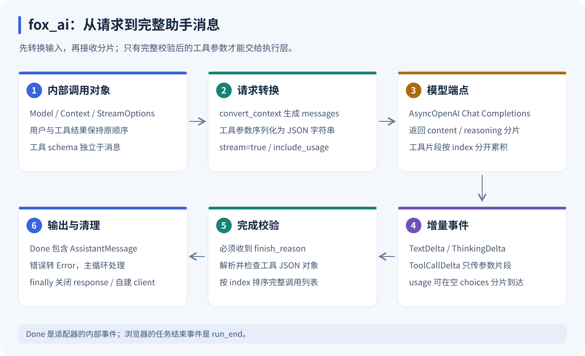

# fox_ai

详细学习指南：[模型协议、流式组装、错误边界与离线练习](../../docs/learning/FOX_AI.md) · [全栈学习索引](../../docs/learning/README.md)



只负责 OpenAI-compatible Chat Completions 调用。五个文件定义消息、五种事件、请求转换、工具参数拼接、reasoning 和 usage。没有 provider registry、retry framework 或厂商专用类。

```python
from fox_ai.src import Model, Context, StreamOptions, UserMessage, stream

async def example():
    async for event in stream(Model("your-model", "https://your-endpoint/v1"),
                              Context([UserMessage("Hello")]), StreamOptions(api_key="key")):
        print(event)
```

事件：TextDelta / ThinkingDelta / ToolCallDelta / Done / Error。
Done 包含完整工具参数。错误或缺少 finish reason 不当作成功，SDK 重试关闭。asyncio 取消会关闭 HTTP response/client。端点实验参数通过 `StreamOptions.extra_body` 显式传入。

验证：仓库根目录 `uv run python -m pytest tests/test_ai.py -q`。
